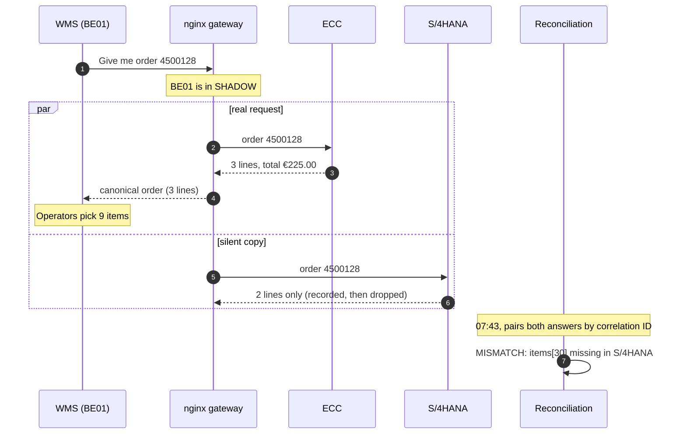

# ERP Migration Router — Business Use Case

> [Business use case](00-business-use-case.md) · [Architecture](01-architecture.md) · [Database schema](02-database-schema.md) · [UML class design](03-uml-class-design.md) · [Development plan](04-development-plan.md)

## Shadow mode, step by step: warehouse BE01 goes live on S/4HANA

### Before the story: shadow mode does not fill S/4HANA

A mirrored request is a **read** (`GET`). It asks S/4HANA "what do you have for this order?". It never
creates, copies or updates anything in S/4HANA. Write operations are deliberately not mirrored: mirroring
"create order" would create the order twice, once in each ERP.

S/4HANA already contains the orders because of the **data migration workstream**, which is separate from
this integration layer:

1. an **initial load** of master data and open orders into S/4HANA;
2. **continuous replication** of new and changed ECC orders into S/4HANA for the whole parallel-run period
   (SAP projects typically use tools such as SLT for this).

The integration layer does not perform that replication. It **checks that it was done correctly**, on real
production traffic.

### Context

A cosmetics group runs warehouse **BE01** near Brussels, shipping to retail stores in Belgium. The group
is migrating from SAP ECC to SAP S/4HANA:

- **FR01 and FR02** (France) went live on S/4HANA last month → phase `CUTOVER`;
- **BE01** is next, go-live planned for **Saturday 14 November 2026**;
- **DE01** (Germany) has not started → phase `LEGACY`.

### Timeline

**Monday 2 November: the parallel run starts.**
The ops team switches BE01 from `LEGACY` to `SHADOW`. Nothing changes for the warehouse: operators work
as usual, and ECC remains the system of record.

**Tuesday 3 November, 07:42: a normal morning.**
The WMS prepares the day's picking waves. To plan a store delivery, it asks for order **4500128**:
`GET /api/v1/warehouses/BE01/orders/4500128`.

1. nginx sees that BE01 is in `SHADOW`. It sends the request to **ECC** and a **copy** to **S/4HANA**.
2. ECC answers: 3 lines (2 × lipstick, 3 × mascara, 4 × foundation), total €225.00.
3. The WMS receives ECC's answer in canonical form and plans the picking. Operators pick 9 items.
4. In parallel, S/4HANA answers the copied request with only **2 lines**: the foundation line is missing.
   Nobody sees that answer, but it is recorded.

| | ECC answer (sent to the WMS) | S/4HANA answer (recorded only) |
|---|---|---|
| Line 10 | 2 × lipstick `MAT-001` | 2 × lipstick `MAT-001` |
| Line 20 | 3 × mascara `MAT-002` | 3 × mascara `MAT-002` |
| Line 30 | 4 × foundation `MAT-003` | **missing** |
| Total | €225.00 | — |

**Tuesday 3 November, 07:43.** The reconciliation service pairs both answers and records a **MISMATCH**:
`items[30]` missing in S/4HANA.

**Thursday 5 November: the readiness report.**

> BE01: match rate **97.1 %**. Top discrepancy: `items[]` missing in S/4HANA, 34 orders, all with 3 or more lines.
> Verdict: **NOT_READY**.

The migration team investigates and finds the root cause: the replication job drops the third schedule
line of multi-line orders. They fix the job and reload the affected orders into S/4HANA.

**Week of 9 November: the evidence builds up.**

> BE01: 1,400 orders over 7 days, match rate **99.8 %**. Verdict: **READY**.

The go-live committee signs off **with numbers from real production orders**, not only with test-case screenshots.

**Saturday 14 November, 22:00: cutover.**
One line changes in `migration-waves.conf` (`BE01 SHADOW;` → `BE01 CUTOVER;`), followed by a gateway
reload.

**Monday 16 November.** The BE01 WMS now gets its orders from S/4HANA, in exactly the same format as
before. If a problem appears, a one-line rollback puts BE01 back in `SHADOW`.

### Why shadowing read requests was worth it

| | Without shadow mode | With shadow mode |
|---|---|---|
| When the missing-line bug is found | **After** go-live, when stores receive deliveries without foundation | On **day 2** of the parallel run |
| Business impact | Wrong deliveries, credit notes, unhappy customers, emergency rollback | **None**: the WMS never saw S/4HANA's wrong answer |
| What S/4HANA was tested against | Test cases someone thought of | **Every real order** the warehouse processed |
| Go-live decision based on | Test sign-off | Measured match rate on production traffic |
