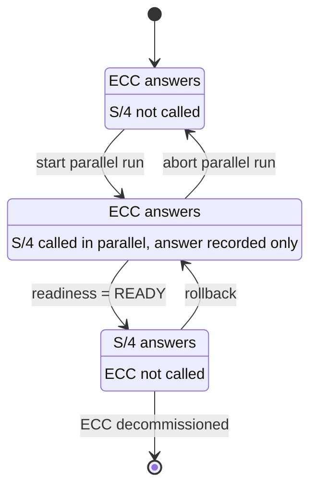
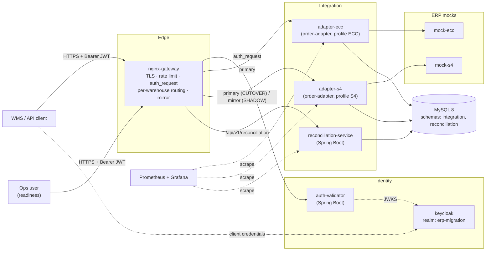
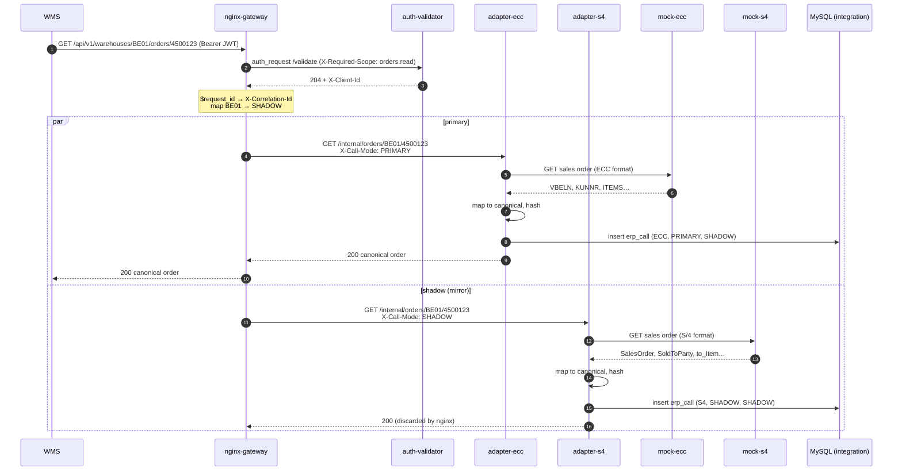
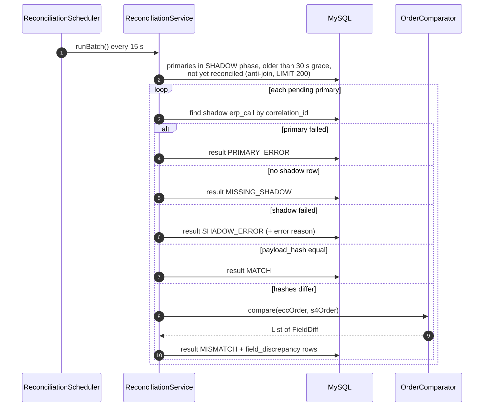
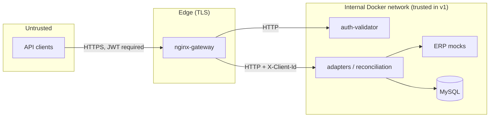

# ERP Migration Router — Architecture

> **Document 1 of 4** · [Architecture](01-architecture.md) · [Database schema](02-database-schema.md) · [UML class design](03-uml-class-design.md) ·
>
> Status: **Design — v1** · Stack: Java 25 / Spring Boot 4, nginx, Keycloak, MySQL 8, Docker Compose

---

## 1. Purpose

This project demonstrates how an integration layer can move a fleet of warehouses from **SAP ECC** to
**SAP S/4HANA** *one warehouse at a time*, without the downstream consumer (a WMS) noticing, and with
**measured evidence** that the new system returns the same business data before each cutover.

It is the architecture of a real migration pattern — the **strangler fig** — applied to ERP integration:

- the consumer always calls **one stable, canonical API**;
- a gateway decides, **per warehouse**, which ERP answers;
- before a warehouse is cut over, S/4HANA runs in **shadow mode**: it receives a copy of every request,
  its answer is recorded but never returned to the consumer;
- a **reconciliation service** compares ECC and S/4 answers and produces a **go / no-go readiness
  metric** per warehouse;
- cutover and rollback are a **one-line configuration change** with a graceful gateway reload.

It is the companion of the **ERP Integration Gateway** project, which covers
outbound OAuth2, idempotency and dead-lettering. This project deliberately focuses on what that one
left out: **an API gateway, inbound authentication, traffic mirroring, reconciliation, and observability.**

---

## 2. Scope

### In scope (v1)

| Capability | How |
|---|---|
| Single canonical order API for the WMS | `GET /api/v1/warehouses/{wh}/orders/{orderId}` behind nginx |
| Per-warehouse routing (LEGACY / SHADOW / CUTOVER) | nginx `map` driven by one config file |
| Shadow traffic to S/4 | nginx `mirror` directive, response discarded |
| Reconciliation and readiness metric | Spring Boot service, asynchronous, correlation-ID based |
| Inbound authentication | Keycloak (OAuth2 Client Credentials) + nginx `auth_request` |
| TLS termination, rate limiting | nginx |
| Resilience | Timeouts, per-mode circuit breakers and bulkhead (Resilience4j) |
| Observability | Structured logs with correlation ID, Micrometer → Prometheus → Grafana |

### Non-goals (v1)

- **Write operations (order creation, updates).** The design is read-only on purpose: mirroring a write
  would execute it twice on two ERPs. Shadowing writes requires a different pattern (see ADR-006).
- **Real SAP connectivity.** ECC and S/4 are Spring Boot mocks returning realistic payload shapes.
- **Outbound authentication to the ERPs.** Already demonstrated in project 1; mocks sit on a trusted
  internal network here.
- **Dynamic routing through an admin API.** The routing table is a versioned file + reload (ADR-004).
- **High availability** of nginx, Keycloak or MySQL. Single instances under Docker Compose.

---

## 3. Migration model

Each warehouse moves through three phases. The phase is the only thing that changes during the
migration; code does not change.



| Phase | Primary (answers the WMS) | Shadow (recorded, discarded) | Reconciled |
|---|---|---|---|
| `LEGACY` | ECC | — | No |
| `SHADOW` | ECC | S/4 | Yes |
| `CUTOVER` | S/4 | — | No |

**Rollback from CUTOVER goes back to SHADOW, not LEGACY**, so that reconciliation keeps producing
evidence while the S/4 issue is investigated.

---

## 4. Component view



### Component responsibilities

| Component | Technology | Responsibility | Owns data |
|---|---|---|---|
| `nginx-gateway` | nginx (open source) | Single entry point: TLS, rate limiting, authentication gate, per-warehouse routing, mirroring, correlation ID, access logs | — |
| `keycloak` | Keycloak | Issues access tokens to API clients (Client Credentials) | Realm config (exported JSON) |
| `auth-validator` | Spring Boot, Spring Security resource server | Validates JWT signature, expiry, audience and required scope for nginx | — |
| `order-adapter` | Spring Boot | Calls one ERP, maps its payload to the canonical model, records every call. **One image, two containers** (`adapter-ecc`, `adapter-s4`) selected by profile | `integration` schema |
| `reconciliation-service` | Spring Boot | Pairs primary/shadow results by correlation ID, compares them field by field, exposes readiness per warehouse | `reconciliation` schema |
| `mock-ecc` | Spring Boot | Returns ECC-shaped sales orders (`VBELN`, `KUNNR`, `KWMENG`…) | — |
| `mock-s4` | Spring Boot | Returns S/4-shaped sales orders (OData v2 style, `SalesOrder`, `SoldToParty`…), with seeded discrepancies | — |
| `canonical-model` | Java library (Maven module) | Canonical DTOs + deterministic serialization and hashing, shared by adapter and reconciliation | — |
| Prometheus / Grafana | — | Metrics: routing volume per phase, ERP latency, breaker state, match rate | — |

**Why one adapter image for both ERPs?** The adapter's job — call an ERP, map, record — is identical;
only the client and the mapper differ. Both are behind an `ErpSourceAdapter` interface (Strategy
pattern) activated by `adapter.erp-system=ECC|S4`. Two containers keep the ERPs isolated at runtime
(separate connection pools, breakers, scaling) without duplicating code.

---

## 5. Request flows

### 5.1 Order read for a warehouse in SHADOW phase



Key properties:

1. **The WMS only ever sees the ECC answer** during SHADOW. A slow or failing S/4 cannot change the
   response content.
2. **Both calls carry the same correlation ID** (nginx `$request_id`), which is the join key for
   reconciliation.
3. **Authentication happens once, before mirroring.** nginx runs `auth_request` in the access phase and
   `mirror` in the precontent phase, so unauthenticated requests are never mirrored.

### 5.2 Reconciliation batch



The 30-second **grace period** exists because the shadow call finishes independently of the primary;
reconciling too early would count in-flight shadow calls as `MISSING_SHADOW`.

### 5.3 Cutover

1. Ops checks `GET /api/v1/reconciliation/readiness?warehouse=BE01` → `READY`.
2. Change `BE01 SHADOW;` to `BE01 CUTOVER;` in `gateway/conf/migration-waves.conf` (reviewed via pull request).
3. `nginx -t && nginx -s reload` — graceful reload: old workers finish in-flight requests, new workers
   take the new routing. No dropped connections.
4. Rollback = revert the line and reload.

---

## 6. Gateway design (nginx)

### 6.1 The routing table

The whole migration plan lives in one small, reviewable file:

```nginx
# gateway/conf/migration-waves.conf — one line per warehouse
map $wh_code $migration_phase {
    default  LEGACY;
    FR01     CUTOVER;
    FR02     CUTOVER;
    BE01     SHADOW;
    BE02     SHADOW;
    DE01     LEGACY;
}

map $migration_phase $primary_upstream {
    CUTOVER  adapter_s4;
    default  adapter_ecc;
}
```

### 6.2 Order route (excerpt)

```nginx
# Extract path parameters from the ORIGINAL request line, so the values are
# identical in the main request and in the mirror subrequest.
map $request_uri $wh_code {
    "~^/api/v1/warehouses/(?<w>[A-Z0-9]{4})/"  $w;
    default                                    "";
}
map $request_uri $order_id {
    "~^/api/v1/warehouses/[A-Z0-9]{4}/orders/(?<o>[0-9]{1,10})(\?.*)?$"  $o;
    default                                                             "";
}

upstream adapter_ecc      { server adapter-ecc:8080;  keepalive 16; }
upstream adapter_s4       { server adapter-s4:8080;   keepalive 16; }
upstream auth_validator   { server auth-validator:8080; }

limit_req_zone $binary_remote_addr zone=per_ip:10m rate=20r/s;

server {
    listen 8443 ssl;
    # ssl_certificate / ssl_certificate_key: local dev certificate (mkcert)

    location ~ ^/api/v1/warehouses/[A-Z0-9]{4}/orders/[0-9]{1,10}$ {
        limit_req          zone=per_ip burst=20 nodelay;
        auth_request       /_auth/orders;
        auth_request_set   $client_id $upstream_http_x_client_id;

        mirror             /_shadow;
        mirror_request_body off;

        proxy_set_header   X-Correlation-Id  $request_id;
        proxy_set_header   X-Migration-Phase $migration_phase;
        proxy_set_header   X-Call-Mode       PRIMARY;
        proxy_set_header   X-Client-Id       $client_id;
        proxy_http_version 1.1;
        proxy_set_header   Connection        "";
        proxy_pass         http://$primary_upstream/internal/orders/$wh_code/$order_id;
    }

    # Mirror target. Every order request triggers it; only SHADOW warehouses go further.
    location = /_shadow {
        internal;
        if ($migration_phase != SHADOW) { return 204; }

        proxy_set_header   X-Correlation-Id  $request_id;
        proxy_set_header   X-Migration-Phase SHADOW;
        proxy_set_header   X-Call-Mode       SHADOW;
        proxy_connect_timeout 1s;
        proxy_read_timeout    3s;
        proxy_http_version 1.1;
        proxy_set_header   Connection        "";
        proxy_pass         http://adapter_s4/internal/orders/$wh_code/$order_id;
    }

    location = /_auth/orders {
        internal;
        proxy_pass              http://auth_validator/validate;
        proxy_pass_request_body off;
        proxy_set_header        Content-Length   "";
        proxy_set_header        X-Required-Scope orders.read;
        proxy_set_header        X-Original-URI   $request_uri;
    }

    # /api/v1/reconciliation/** → reconciliation-service, same pattern with scope reconciliation.read
}
```

### 6.3 Design notes

| Decision | Reason |
|---|---|
| Path parameters parsed from `$request_uri` via `map` | The mirror is a subrequest to `/_shadow`; `$uri` there is `/_shadow`. `$request_uri` always holds the client's original request line. |
| `mirror` always configured, filtered with `if … return 204` | The mirror target cannot be switched off per warehouse by a variable; returning early in the mirror location is the standard, safe use of `if` (only `return` inside it). |
| Strict path regex (`[A-Z0-9]{4}`, `[0-9]{1,10}`) | Input validation at the edge; malformed IDs never reach the adapters (nginx returns 404). |
| Short shadow timeouts (1 s connect / 3 s read) | nginx waits for the mirror subrequest before processing the **next** request on the same client keep-alive connection. A slow S/4 must not slow down the primary path. |
| `$request_id` as correlation ID | 32 hex characters, unique per request, generated by nginx, shared by the mirror subrequest. |
| Header names set in both locations | `proxy_set_header` in a parent location does not apply to the internal mirror location. |

### 6.4 Access log

JSON log format so every line can be joined to the database by correlation ID:

```nginx
log_format json_access escape=json '{'
  '"ts":"$time_iso8601","correlation_id":"$request_id","client_id":"$client_id",'
  '"warehouse":"$wh_code","phase":"$migration_phase","status":$status,'
  '"upstream":"$upstream_addr","upstream_time":"$upstream_response_time",'
  '"request_time":$request_time,"uri":"$request_uri"}';
```

---

## 7. Security design

### 7.1 Trust boundaries



- Only `nginx-gateway` (8443) and `keycloak` (token endpoint) are published to the host. Adapters,
  mocks and MySQL are reachable **only** on the internal Docker network.
- Internal services trust `X-Client-Id` / `X-Correlation-Id` because the only way in is through nginx.
  In production this would be backed by mTLS or network policies (see Risks).

### 7.2 Keycloak configuration

| Item | Value |
|---|---|
| Realm | `erp-migration` (exported to `keycloak/realm-export.json`, imported at start-up) |
| Client `wms-client` | Confidential, Client Credentials only, scope `orders.read` |
| Client `ops-client` | Confidential, Client Credentials only, scope `reconciliation.read` |
| Access token | JWT, RS256, 5-minute lifetime, audience `erp-migration-api` |

### 7.3 Why `auth_request` + `auth-validator`

Open-source nginx **cannot validate JWTs natively** (`auth_jwt` is an NGINX Plus module). Options were:

| Option | Verdict |
|---|---|
| NGINX Plus `auth_jwt` | Commercial licence — not reproducible by readers of this repo |
| OpenResty + Lua JWT library | Works, but moves security logic into Lua scripts that are hard to test |
| Keycloak token introspection directly from nginx | Introspection is a `POST` with client credentials; `auth_request` subrequests do not carry a body, and every call would hit Keycloak |
| **`auth_request` → small Spring resource server** ✅ | JWT verified locally against cached JWKS (no Keycloak round-trip per call), standard Spring Security, unit-testable |

`auth-validator` contract:

| Result | Returned to nginx | nginx behaviour |
|---|---|---|
| Valid token with required scope | `204` + `X-Client-Id: <azp>` | Request continues |
| Missing / invalid / expired token | `401` | `401` to client |
| Valid token, scope missing | `403` | `403` to client |
| Validator down | connection error | `500` to client — **fail closed** |

---

## 8. Reconciliation design

### 8.1 Canonical comparison

Both adapters produce the **same canonical model** (`canonical-model` module). Comparison therefore
compares business meaning, not ERP formats.

1. **Deterministic serialization** — `CanonicalSerializer` writes JSON with sorted keys, items sorted
   by `lineNumber`, `BigDecimal` normalized with `stripTrailingZeros()`, dates in ISO-8601.
2. **Hash shortcut** — SHA-256 of that JSON is stored as `payload_hash`. Equal hashes ⇒ `MATCH`,
   no field comparison needed (most rows once the mapping is correct).
3. **Field-level diff** only when hashes differ — `OrderComparator` compares header fields, then items
   matched **by line number** (not by list position, which would cascade one missing line into every
   following line).

### 8.2 Result statuses

| Status | Meaning | Counts in match rate? |
|---|---|---|
| `MATCH` | Canonical payloads identical | Yes (success) |
| `MISMATCH` | Both succeeded, at least one field differs | Yes (failure) |
| `SHADOW_ERROR` | S/4 call or S/4 mapping failed | Yes (failure) — a mapping gap is a migration defect |
| `MISSING_SHADOW` | No S/4 record after the grace period | Yes (failure) |
| `PRIMARY_ERROR` | ECC call failed; nothing to compare | **No** — not S/4's fault |

### 8.3 Readiness

```
GET /api/v1/reconciliation/readiness?warehouse=BE01
```

```json
{
  "warehouseCode": "BE01",
  "windowDays": 7,
  "sampleSize": 1240,
  "matchRatePct": 99.68,
  "verdict": "READY",
  "topDiscrepancies": [
    { "field": "totalAmount", "occurrences": 3 },
    { "field": "items[].unit", "occurrences": 1 }
  ]
}
```

Verdict rule (configurable via `reconciliation.cutover-criteria.*`):
`READY` if `sampleSize ≥ 500` **and** `matchRatePct ≥ 99.5`, otherwise `NOT_READY`.

### 8.4 Seeded discrepancies in `mock-s4`

To make reconciliation demonstrable, `mock-s4` deliberately differs from `mock-ecc` for some order IDs:

| Order ID ends with | S/4 behaviour | Expected result |
|---|---|---|
| `7` | `TotalNetAmount` off by 0.01 | `MISMATCH` on `totalAmount` |
| `8` | One item line missing | `MISMATCH` on `items[]` (missing in S/4) |
| `9` | Unit of measure `KAR`, absent from `uom_mapping` | `SHADOW_ERROR` (unmappable) — fixed by inserting a mapping row, **no redeploy** |
| other | Same business data, S/4 formats (OData date, internal UoM `ST`, no leading zeros) | `MATCH` after normalization |

Scenarios can be turned off with `mock.s4.scenarios.enabled=false` to show a warehouse becoming `READY`.

---

## 9. Mapping: ECC vs S/4 vs canonical

| Canonical field | ECC (`mock-ecc`) | S/4 (`mock-s4`, OData v2 style) | Normalization |
|---|---|---|---|
| `orderId` | `VBELN` `"0004500123"` | `SalesOrder` `"4500123"` | Strip leading zeros |
| `customerId` | `KUNNR` `"0000100234"` | `SoldToParty` `"100234"` | Strip leading zeros |
| `orderDate` | `AUDAT` `"20260912"` | `SalesOrderDate` `"/Date(1789171200000)/"` | → `LocalDate` (UTC) |
| `totalAmount` | `NETWR` `"1450.00"` | `TotalNetAmount` `"1450.00"` | → `BigDecimal` |
| `currency` | `WAERK` | `TransactionCurrency` | as is |
| `status` | `GBSTK` `A/B/C` | `OverallSDProcessStatus` `A/B/C` | `A→OPEN`, `B→IN_PROGRESS`, `C→COMPLETED`, else unmappable |
| `items[].lineNumber` | `POSNR` `"000010"` | `SalesOrderItem` `"10"` | → `int` |
| `items[].sku` | `MATNR` | `Material` | as is |
| `items[].quantity` | `KWMENG` `"2.000"` | `RequestedQuantity` `"2"` | → `BigDecimal`, trailing zeros stripped |
| `items[].unit` | `VRKME` `"EA"` | `RequestedQuantityUnit` `"ST"` | via `uom_mapping` table (per ERP) |

Mocks are *modeled on* ECC tables (VBAK/VBAP/VBUK) and the S/4 `API_SALES_ORDER_SRV` OData service;
they are not exhaustive reproductions.

---

## 10. Resilience

| Concern | Mechanism |
|---|---|
| ERP slow | `RestClient` timeouts: connect 1 s, read 2 s |
| ERP down | Resilience4j **circuit breaker**, one per `(erp, call mode)`: `ecc-primary`, `s4-primary`, `s4-shadow` |
| Shadow traffic overloading `adapter-s4` | Resilience4j **bulkhead** on `s4-shadow` (max 10 concurrent); excess shadow calls are rejected and recorded as `SHADOW_ERROR` |
| Shadow slowing the primary path | nginx shadow timeouts (§6.3); mirror response never awaited for the client response |
| Recording failure | Recording is best-effort *after* the response is built; a DB error is logged and counted, never turned into a 5xx for the WMS |
| Duplicate records (nginx upstream retry) | Unique key `(correlation_id, erp_system)`; duplicate insert is ignored |

**Why separate breakers per call mode?** `adapter-s4` serves shadow traffic (for SHADOW warehouses)
**and** real traffic (for CUTOVER warehouses). With one shared breaker, a burst of shadow failures would
open the circuit and take down warehouses already live on S/4. Separate breakers + a bulkhead isolate
the experiment from production traffic.

---

## 11. Observability

| Signal | Source | Example use |
|---|---|---|
| Access logs (JSON) | nginx | Requests per warehouse and phase, 4xx/5xx, latency |
| Application logs | Spring Boot (Logback JSON) with `correlationId` in MDC | Trace one request across nginx → adapter → ERP → DB |
| Metrics | Micrometer `/actuator/prometheus` | `erp_call_seconds{erp,mode,outcome}`, `resilience4j_circuitbreaker_state`, `reconciliation_results_total{warehouse,status}` |
| Dashboard | Grafana (provisioned JSON) | Traffic by phase, ERP latency p95, breaker state, match rate per warehouse |

---

## 12. External API

All external routes go through `https://localhost:8443` with `Authorization: Bearer <token>`.

| Method & path | Scope | Backend | Responses |
|---|---|---|---|
| `GET /api/v1/warehouses/{wh}/orders/{orderId}` | `orders.read` | primary adapter | `200` canonical order · `401` · `403` · `404` · `422` · `429` · `503` |
| `GET /api/v1/reconciliation/readiness?warehouse={wh}` | `reconciliation.read` | reconciliation-service | `200` readiness · `401` · `403` · `404` unknown warehouse |
| `GET /api/v1/reconciliation/results?warehouse={wh}&status={s}&page={n}` | `reconciliation.read` | reconciliation-service | `200` page of results with discrepancies |

Errors use **RFC 9457 Problem Details** (`application/problem+json`), always including `correlationId`:

```json
{
  "type": "https://erp-migration.local/problems/unmappable-order",
  "title": "Order cannot be mapped to the canonical model",
  "status": 422,
  "detail": "Unknown unit of measure 'KAR' for ERP S4",
  "correlationId": "5e1f0c3a9b7d4e21a8f6c0d2b4e6a8c1"
}
```

Internal adapter route (not exposed): `GET /internal/orders/{wh}/{orderId}`, requires headers
`X-Correlation-Id`, `X-Migration-Phase`, `X-Call-Mode`.

---

## 13. Repository layout and deployment

```
erp-migration-router/
├── pom.xml                      # Maven parent (Java 25, Spring Boot 4)
├── canonical-model/             # shared library
├── order-adapter/               # one image → adapter-ecc, adapter-s4
├── reconciliation-service/
├── auth-validator/
├── mock-ecc/
├── mock-s4/
├── gateway/
│   ├── conf/nginx.conf
│   ├── conf/migration-waves.conf
│   └── certs/                   # generated locally, git-ignored
├── keycloak/realm-export.json
├── observability/               # prometheus.yml, grafana dashboards
├── docker-compose.yml
└── docs/
```

| Container | Published port | Health gate |
|---|---|---|
| `nginx-gateway` | `8443` | depends on adapters, auth-validator healthy |
| `keycloak` | `8180` | `/health/ready` |
| `grafana` | `3000` | — |
| all others | internal only | `/actuator/health`; adapters and reconciliation wait for MySQL healthy |

---

## 14. Architecture decision records

### ADR-001 — nginx as gateway rather than Spring Cloud Gateway
**Context:** routing, mirroring, TLS, rate limiting at the edge. **Decision:** nginx.
**Why:** mirroring and weighted/conditional routing are native, the routing table is plain config that
reloads gracefully, and nginx is what most client infrastructures already run in front of integration
platforms. **Trade-off:** logic outside Java (harder to unit-test); mitigated by keeping nginx logic
declarative and testing it end-to-end with `curl` scripts.

### ADR-002 — Asynchronous reconciliation by correlation ID
**Context:** nginx discards mirror responses, so it cannot compare. **Decision:** each adapter
persists its canonical result; a separate service pairs them later. **Alternative rejected:** a Spring
"dual-call" router comparing inline — simpler, but adds S/4 latency and failure modes to every primary
request, and removes the gateway's role. **Trade-off:** results are available after a delay (grace
period), acceptable for a go/no-go metric.

### ADR-003 — JWT validation through `auth_request` and a Spring validator
See §7.3.

### ADR-004 — Static routing file + graceful reload
**Decision:** migration phases live in `migration-waves.conf`, changed by pull request.
**Why:** every cutover is reviewed, versioned and revertible with `git revert`; no admin API to secure.
**v2 option:** a control-plane endpoint writing to OpenResty shared memory for zero-reload changes.

### ADR-005 — One MySQL instance, one schema per service
**Decision:** `integration` owned by `order-adapter`, `reconciliation` owned by
`reconciliation-service`. Reconciliation reads `integration.erp_call` through a **read-only** DB user.
**Trade-off:** a cross-schema read couples reconciliation to the adapter's table layout — a known
compromise of "database per service". **v2 option:** adapters publish `ErpCallRecorded` events
(transactional outbox → Kafka) and reconciliation builds its own copy.

### ADR-006 — Read-only migration scope
**Decision:** only read operations are routed and mirrored. **Why:** mirroring a write (create order)
would create it in both ERPs. Shadowing writes would require sending S/4 a **dry-run/simulation** call
or a separate sandbox tenant — out of scope for v1 and called out explicitly.

---

## 15. Risks and known limitations

| Risk / limitation | Impact | Mitigation / next step |
|---|---|---|
| Internal network trusted (no mTLS) | A compromised container could call adapters directly with forged headers | v2: mTLS between nginx and services, or per-service JWT validation (defence in depth) |
| Mirror doubles load on the integration layer for SHADOW warehouses | Capacity | Bulkhead on shadow calls; shadow a *sample* with `split_clients` if needed |
| Mocks return mostly fixed data | Reconciliation realism | Seeded scenarios (§8.4) cover value diffs, missing lines and mapping gaps |
| Single nginx / Keycloak / MySQL | No HA | Out of scope; Compose demo |
| Reconciliation reads another service's schema | Coupling | ADR-005, v2 event-based |
| Raw payload retention grows unbounded | Storage | v1: documented purge query; v2: scheduled purge job |
