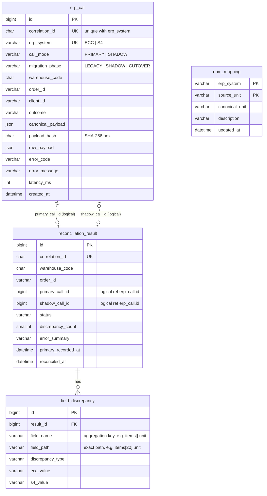

# ERP Migration Router — Database Schema

> **Document 2 of 4** · [Architecture](01-architecture.md) · [Database schema](02-database-schema.md) · [UML class design](03-uml-class-design.md) · [Development plan](04-development-plan.md)
>
> Engine: **MySQL 8.0.16+** (CHECK constraints enforced) · Migrations: **Flyway**, one history table per schema

---

## 1. Ownership model

One MySQL instance, **one schema per owning service** (see ADR-005 in the architecture document).

| Schema | Owner (read/write) | Other readers | Content |
|---|---|---|---|
| `integration` | `order-adapter` (both `adapter-ecc` and `adapter-s4`) | `reconciliation-service`, **read-only, `erp_call` only** | Every ERP call and its canonical result; unit-of-measure mapping |
| `reconciliation` | `reconciliation-service` | — | Pairing results, field-level discrepancies, readiness view |

Rules:

- **No foreign keys across schemas.** `reconciliation_result.primary_call_id` refers to
  `integration.erp_call.id` *logically*. A physical FK would forbid the adapter from ever purging or
  restructuring its own table, and would not survive a future split into two databases.
- Each service runs **its own Flyway** against its own schema (`flyway_schema_history` lives in each).
- Codes (`erp_system`, `status`…) are `VARCHAR` + `CHECK`, not MySQL `ENUM`: they map directly to
  JPA `@Enumerated(EnumType.STRING)`, and adding a value never depends on ENUM ordinal order.
- Timestamps are `DATETIME(3)` in **UTC** (millisecond precision; JDBC `connectionTimeZone=UTC`).
- Identifiers that are pure ASCII (`correlation_id`, hashes) use `CHARACTER SET ascii` to halve index size
  compared with `utf8mb4`.

---

## 2. Entity-relationship overview



Solid line = physical foreign key. Dotted line = logical reference across schemas (no FK).
`uom_mapping` is a configuration table read by the adapters' mappers; it has no relationship to call data.

---

## 3. Schema `integration`

### 3.1 `erp_call`

One row per ERP call made by an adapter — primary **and** shadow. It is at the same time an audit log,
the source for reconciliation, and the debugging trail for a correlation ID.

```sql
CREATE TABLE erp_call (
    id                 BIGINT UNSIGNED  NOT NULL AUTO_INCREMENT,
    correlation_id     CHAR(32)         CHARACTER SET ascii NOT NULL,
    erp_system         VARCHAR(4)       NOT NULL,
    call_mode          VARCHAR(7)       NOT NULL,
    migration_phase    VARCHAR(7)       NOT NULL,
    warehouse_code     CHAR(4)          NOT NULL,
    order_id           VARCHAR(10)      NOT NULL,
    client_id          VARCHAR(64)      NULL,
    outcome            VARCHAR(20)      NOT NULL,
    canonical_payload  JSON             NULL,
    payload_hash       CHAR(64)         CHARACTER SET ascii NULL,
    raw_payload        JSON             NULL,
    error_code         VARCHAR(50)      NULL,
    error_message      VARCHAR(1000)    NULL,
    latency_ms         INT UNSIGNED     NOT NULL,
    created_at         DATETIME(3)      NOT NULL DEFAULT CURRENT_TIMESTAMP(3),

    CONSTRAINT pk_erp_call PRIMARY KEY (id),
    CONSTRAINT uk_erp_call_correlation UNIQUE (correlation_id, erp_system),

    CONSTRAINT ck_erp_call_erp_system CHECK (erp_system IN ('ECC', 'S4')),
    CONSTRAINT ck_erp_call_call_mode  CHECK (call_mode IN ('PRIMARY', 'SHADOW')),
    CONSTRAINT ck_erp_call_phase      CHECK (migration_phase IN ('LEGACY', 'SHADOW', 'CUTOVER')),
    CONSTRAINT ck_erp_call_outcome    CHECK (outcome IN
        ('SUCCESS', 'NOT_FOUND', 'UNMAPPABLE', 'ERP_UNAVAILABLE', 'REJECTED')),
    -- a successful call always has a canonical result; a failed one never does
    CONSTRAINT ck_erp_call_success_payload CHECK (
        (outcome = 'SUCCESS'  AND canonical_payload IS NOT NULL AND payload_hash IS NOT NULL)
     OR (outcome <> 'SUCCESS' AND canonical_payload IS NULL     AND payload_hash IS NULL)),
    -- shadow calls only exist for SHADOW warehouses, and only against S/4
    CONSTRAINT ck_erp_call_shadow_consistency CHECK (
        call_mode = 'PRIMARY' OR (migration_phase = 'SHADOW' AND erp_system = 'S4')),

    INDEX ix_erp_call_pending   (call_mode, migration_phase, created_at),
    INDEX ix_erp_call_wh_time   (warehouse_code, created_at)
) ENGINE = InnoDB DEFAULT CHARSET = utf8mb4 COLLATE = utf8mb4_0900_ai_ci;
```

| Column | Notes |
|---|---|
| `correlation_id` | nginx `$request_id`. Primary and shadow calls of the same request share it. |
| `call_mode` / `migration_phase` | Copied from the `X-Call-Mode` / `X-Migration-Phase` headers set by nginx. Stored, not recomputed, because the phase of a warehouse **changes over time** — the row must say what it was at call time. |
| `outcome` | `REJECTED` = shadow call refused by the bulkhead (never reached the ERP). |
| `canonical_payload` | Deterministic canonical JSON (sorted keys, normalized decimals). Compared by reconciliation. |
| `payload_hash` | SHA-256 of `canonical_payload` text. Equal hashes ⇒ `MATCH` without parsing JSON. |
| `raw_payload` | ERP response as received. For debugging mapping issues; purged after 30 days (§6). |

**Outcome → HTTP status** returned by the adapter: `SUCCESS` 200 · `NOT_FOUND` 404 ·
`UNMAPPABLE` 422 · `ERP_UNAVAILABLE` 503 · `REJECTED` 503.

### 3.2 `uom_mapping`

Maps each ERP's unit-of-measure code to the canonical unit. Stored in the database rather than in code
so that a mapping gap found by reconciliation is fixed by **inserting a row**, not by a redeploy.

```sql
CREATE TABLE uom_mapping (
    erp_system      VARCHAR(4)    NOT NULL,
    source_unit     VARCHAR(3)    NOT NULL,
    canonical_unit  VARCHAR(3)    NOT NULL,
    description     VARCHAR(100)  NULL,
    updated_at      DATETIME(3)   NOT NULL DEFAULT CURRENT_TIMESTAMP(3) ON UPDATE CURRENT_TIMESTAMP(3),

    CONSTRAINT pk_uom_mapping PRIMARY KEY (erp_system, source_unit),
    CONSTRAINT ck_uom_mapping_erp_system CHECK (erp_system IN ('ECC', 'S4'))
) ENGINE = InnoDB DEFAULT CHARSET = utf8mb4 COLLATE = utf8mb4_0900_ai_ci;

-- V2__create_and_seed_uom_mapping.sql (seed part)
INSERT INTO uom_mapping (erp_system, source_unit, canonical_unit, description) VALUES
    ('ECC', 'EA',  'EA',  'Each'),
    ('ECC', 'CT',  'CT',  'Carton'),
    ('ECC', 'PAL', 'PAL', 'Pallet'),
    ('S4',  'ST',  'EA',  'Piece (S/4 internal code) → Each'),
    ('S4',  'PAL', 'PAL', 'Pallet');
-- ('S4', 'KAR', 'CT') is deliberately missing: mock-s4 scenario "order ID ends with 9"
-- produces SHADOW_ERROR until this row is added (demo of fixing a mapping gap without redeploy).
```

The adapter caches the table in memory with a **60-second TTL**, so a new row takes effect within a minute.

---

## 4. Schema `reconciliation`

### 4.1 `reconciliation_result`

Exactly one row per reconciled request (per correlation ID).

```sql
CREATE TABLE reconciliation_result (
    id                   BIGINT UNSIGNED    NOT NULL AUTO_INCREMENT,
    correlation_id       CHAR(32)           CHARACTER SET ascii NOT NULL,
    warehouse_code       CHAR(4)            NOT NULL,
    order_id             VARCHAR(10)        NOT NULL,
    primary_call_id      BIGINT UNSIGNED    NOT NULL,   -- logical ref: integration.erp_call.id
    shadow_call_id       BIGINT UNSIGNED    NULL,       -- logical ref: integration.erp_call.id
    status               VARCHAR(15)        NOT NULL,
    discrepancy_count    SMALLINT UNSIGNED  NOT NULL DEFAULT 0,
    error_summary        VARCHAR(500)       NULL,
    primary_recorded_at  DATETIME(3)        NOT NULL,   -- erp_call.created_at of the primary
    reconciled_at        DATETIME(3)        NOT NULL DEFAULT CURRENT_TIMESTAMP(3),

    CONSTRAINT pk_reconciliation_result PRIMARY KEY (id),
    CONSTRAINT uk_reconciliation_result_correlation UNIQUE (correlation_id),
    CONSTRAINT ck_reconciliation_result_status CHECK (status IN
        ('MATCH', 'MISMATCH', 'SHADOW_ERROR', 'MISSING_SHADOW', 'PRIMARY_ERROR')),
    CONSTRAINT ck_reconciliation_result_shadow CHECK (
        (status = 'MISSING_SHADOW' AND shadow_call_id IS NULL)
     OR (status IN ('MATCH', 'MISMATCH', 'SHADOW_ERROR') AND shadow_call_id IS NOT NULL)
     OR  status = 'PRIMARY_ERROR'),
    CONSTRAINT ck_reconciliation_result_count CHECK (
        (status = 'MISMATCH' AND discrepancy_count > 0) OR (status <> 'MISMATCH' AND discrepancy_count = 0)),

    INDEX ix_reconciliation_result_wh_time (warehouse_code, primary_recorded_at, status)
) ENGINE = InnoDB DEFAULT CHARSET = utf8mb4 COLLATE = utf8mb4_0900_ai_ci;
```

- `uk_reconciliation_result_correlation` makes reconciliation **idempotent**: if two scheduler runs
  overlap, the second insert fails on the unique key and is ignored.
- Readiness windows are computed on `primary_recorded_at` (when the traffic happened), not
  `reconciled_at` (when the batch ran).

### 4.2 `field_discrepancy`

```sql
CREATE TABLE field_discrepancy (
    id                BIGINT UNSIGNED  NOT NULL AUTO_INCREMENT,
    result_id         BIGINT UNSIGNED  NOT NULL,
    field_name        VARCHAR(100)     NOT NULL,   -- 'totalAmount', 'items[].unit'
    field_path        VARCHAR(200)     NOT NULL,   -- 'totalAmount', 'items[20].unit'
    discrepancy_type  VARCHAR(15)      NOT NULL,
    ecc_value         VARCHAR(500)     NULL,
    s4_value          VARCHAR(500)     NULL,

    CONSTRAINT pk_field_discrepancy PRIMARY KEY (id),
    CONSTRAINT fk_field_discrepancy_result FOREIGN KEY (result_id)
        REFERENCES reconciliation_result (id) ON DELETE CASCADE,
    CONSTRAINT ck_field_discrepancy_type CHECK (discrepancy_type IN
        ('VALUE_DIFF', 'MISSING_IN_S4', 'MISSING_IN_ECC')),

    INDEX ix_field_discrepancy_field (field_name)
) ENGINE = InnoDB DEFAULT CHARSET = utf8mb4 COLLATE = utf8mb4_0900_ai_ci;
```

**Why two field columns?** `field_path` identifies the exact line (`items[20].unit`) for investigation;
`field_name` removes the line number (`items[].unit`) so that `GROUP BY field_name` shows *which kind*
of field is wrong across all orders. Grouping on `field_path` would scatter one systematic mapping
bug over hundreds of distinct paths.

(`result_id` needs no separate index: InnoDB creates one automatically for the foreign key.)

### 4.3 View `v_warehouse_readiness`

```sql
CREATE VIEW v_warehouse_readiness AS
SELECT warehouse_code,
       COUNT(*)                                             AS sample_size,
       SUM(status = 'MATCH')                                AS matches,
       ROUND(100 * SUM(status = 'MATCH') / COUNT(*), 2)     AS match_rate_pct,
       MAX(primary_recorded_at)                             AS last_traffic_at
FROM   reconciliation_result
WHERE  status <> 'PRIMARY_ERROR'                            -- ECC failures are not S/4's fault
  AND  primary_recorded_at >= UTC_TIMESTAMP(3) - INTERVAL 7 DAY
GROUP  BY warehouse_code;
```

`SUM(status = 'MATCH')` works because MySQL evaluates a boolean expression to `1` or `0`.
The verdict (`READY` / `NOT_READY`) is **not** computed in SQL: thresholds are application
configuration (`reconciliation.cutover-criteria.*`), applied by `ReadinessService`.

---

## 5. Key queries and the indexes that serve them

### Q1 — Pending primaries to reconcile (reconciliation scheduler, every 15 s)

```sql
SELECT p.id, p.correlation_id, p.warehouse_code, p.order_id, p.outcome,
       p.canonical_payload, p.payload_hash, p.error_code, p.created_at
FROM   integration.erp_call p
LEFT   JOIN reconciliation.reconciliation_result r
       ON r.correlation_id = p.correlation_id
WHERE  p.call_mode       = 'PRIMARY'
  AND  p.migration_phase = 'SHADOW'
  AND  p.created_at <  UTC_TIMESTAMP(3) - INTERVAL 30 SECOND   -- grace period
  AND  p.created_at >= UTC_TIMESTAMP(3) - INTERVAL 7 DAY       -- bounded scan
  AND  r.id IS NULL                                            -- anti-join: not yet reconciled
ORDER  BY p.created_at
LIMIT  200;
```

Served by `ix_erp_call_pending (call_mode, migration_phase, created_at)` — two equality columns first,
then the range column — and by `uk_reconciliation_result_correlation` for the anti-join probe.

### Q2 — Shadow counterpart of a primary

```sql
SELECT id, outcome, canonical_payload, payload_hash, error_code, error_message
FROM   integration.erp_call
WHERE  correlation_id = ? AND erp_system = 'S4';
```

Served by the unique key `uk_erp_call_correlation (correlation_id, erp_system)` — at most one row.

### Q3 — Top discrepant fields per warehouse (readiness endpoint)

```sql
SELECT d.field_name, COUNT(*) AS occurrences
FROM   field_discrepancy d
JOIN   reconciliation_result r ON r.id = d.result_id
WHERE  r.warehouse_code = ?
  AND  r.primary_recorded_at >= UTC_TIMESTAMP(3) - INTERVAL 7 DAY
GROUP  BY d.field_name
ORDER  BY occurrences DESC
LIMIT  5;
```

Served by `ix_reconciliation_result_wh_time` (filter) then the FK index on `field_discrepancy.result_id` (join).

### Q4 — Full trail of one request (support / debugging)

```sql
SELECT c.erp_system, c.call_mode, c.outcome, c.latency_ms, c.error_message,
       r.status, r.discrepancy_count
FROM   integration.erp_call c
LEFT   JOIN reconciliation.reconciliation_result r ON r.correlation_id = c.correlation_id
WHERE  c.correlation_id = ?;
```

The same correlation ID appears in the nginx access log, the adapter logs, and the Problem Details body
returned to the client — one ID to follow a request end to end.

---

## 6. Data lifecycle

| Data | Retention | Mechanism |
|---|---|---|
| `erp_call.raw_payload` | 30 days | Nulled in batches (below) |
| `erp_call` rows | 90 days | Batched delete (v2 job; v1 documented only) |
| `reconciliation_result` + discrepancies | Kept while the warehouse migration is open | Deleted per warehouse after ECC decommissioning (`ON DELETE CASCADE` removes discrepancies) |

Purge in **small batches** so no long-running transaction locks rows the adapters are writing:

```sql
UPDATE integration.erp_call
SET    raw_payload = NULL
WHERE  created_at < UTC_TIMESTAMP(3) - INTERVAL 30 DAY
  AND  raw_payload IS NOT NULL
LIMIT  5000;          -- repeat until 0 rows affected
```

**Rough sizing assumption** (to justify the retention rules, not a benchmark): 5 warehouses in SHADOW at
10,000 order reads/day each = 100,000 `erp_call` rows/day (primary + shadow). At ~3 KB per row with
both payloads, that is roughly 300 MB/day, ~9 GB/month before purging `raw_payload`.

---

## 7. Database users and privileges

```sql
CREATE DATABASE integration    CHARACTER SET utf8mb4 COLLATE utf8mb4_0900_ai_ci;
CREATE DATABASE reconciliation CHARACTER SET utf8mb4 COLLATE utf8mb4_0900_ai_ci;

-- order-adapter: owns its schema (includes DDL for Flyway)
CREATE USER 'adapter_app'@'%' IDENTIFIED BY '${ADAPTER_DB_PASSWORD}';
GRANT ALL PRIVILEGES ON integration.* TO 'adapter_app'@'%';

-- reconciliation-service: owns its schema + read-only on ONE foreign table
CREATE USER 'recon_app'@'%' IDENTIFIED BY '${RECON_DB_PASSWORD}';
GRANT ALL PRIVILEGES ON reconciliation.*    TO 'recon_app'@'%';
GRANT SELECT         ON integration.erp_call TO 'recon_app'@'%';
```

**v1 simplification:** the init script runs before Flyway has created `erp_call`, and MySQL refuses a
table-level `GRANT` on a table that does not exist yet. v1 therefore grants `SELECT ON integration.*`
(still read-only). The table-level grant above is the target; applying it needs a post-migration step.

Passwords come from `.env` (never committed). In production, the DDL privileges used by Flyway would
belong to a separate migration user, and the runtime user would only get `SELECT, INSERT, UPDATE, DELETE`.

---

## 8. Flyway layout

```
order-adapter/src/main/resources/db/migration/
├── V1__create_erp_call.sql
└── V2__create_and_seed_uom_mapping.sql

reconciliation-service/src/main/resources/db/migration/
├── V1__create_reconciliation_result.sql
├── V2__create_field_discrepancy.sql
└── V3__create_v_warehouse_readiness.sql
```

Each service sets `spring.flyway.schemas` to its own schema only. The reconciliation service never
migrates `integration`: it depends on `erp_call` as an **external contract** — any change to the
columns it reads (Q1, Q2) must stay backward-compatible or be coordinated.

`order-adapter` runs as **two containers on the same schema**. Only `adapter-ecc` runs Flyway
(`spring.flyway.enabled=true`); `adapter-s4` starts with `SPRING_FLYWAY_ENABLED=false` and waits for
`adapter-ecc` to be healthy. One migrator per schema avoids two instances racing on the same history table.

The MySQL container creates both databases and users from an init **shell** script
(`mysql/init/01-init.sh`), not a `.sql` file: `.sql` files in `docker-entrypoint-initdb.d` do not expand
environment variables, so `${ADAPTER_DB_PASSWORD}` would be stored literally as the password.
