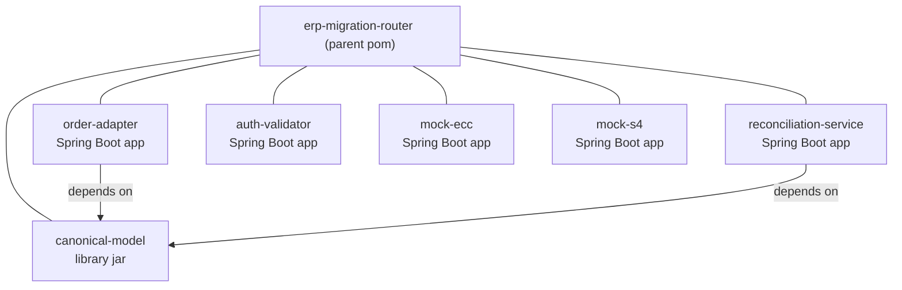
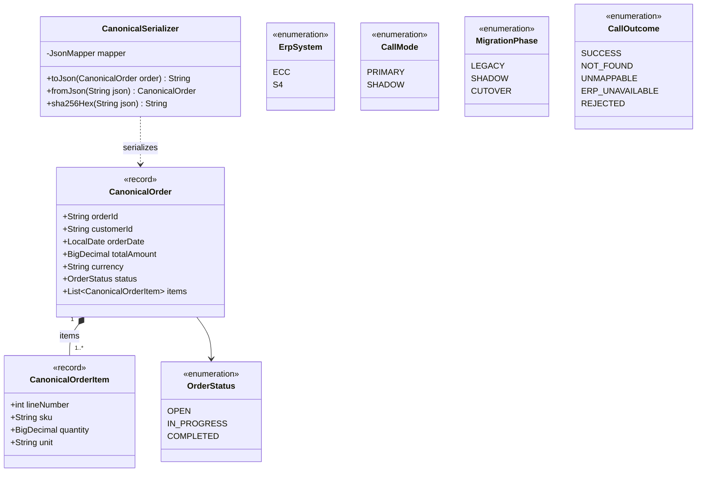
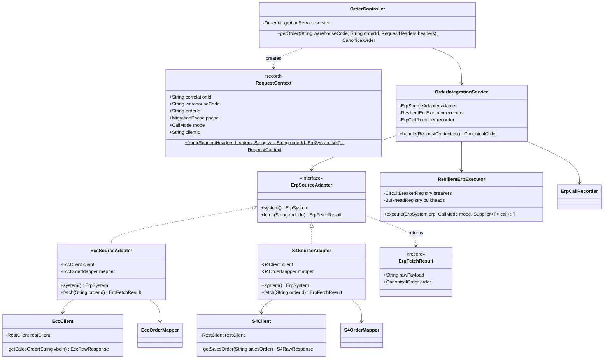
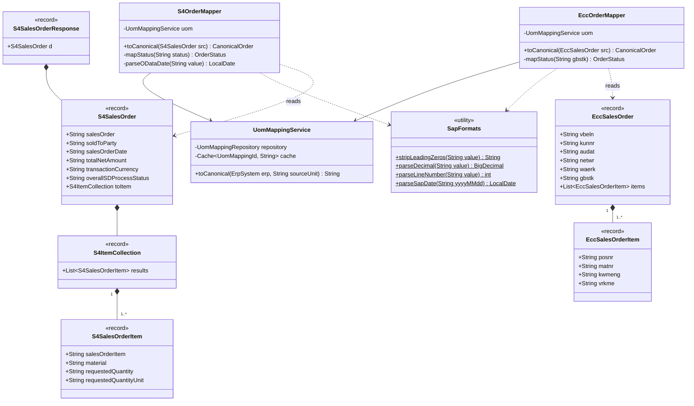
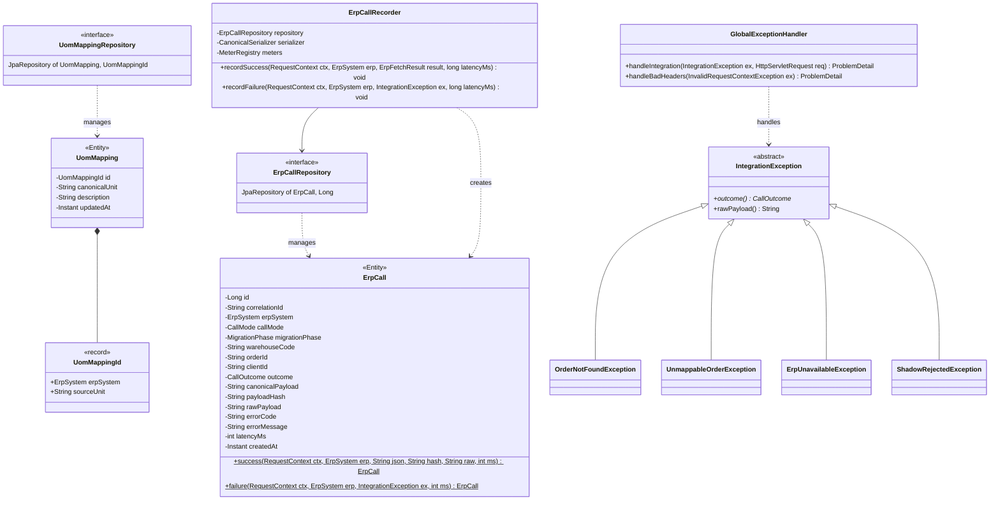
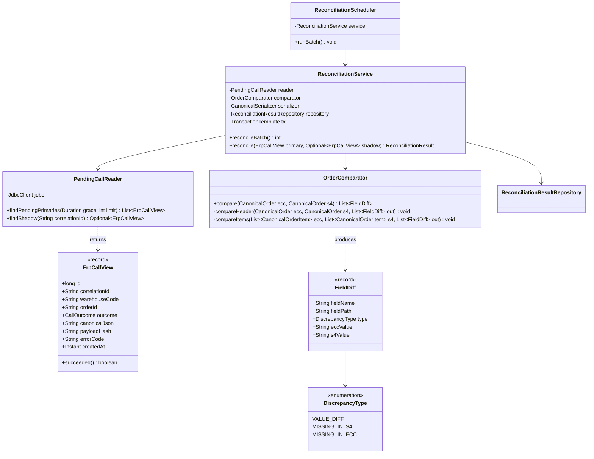
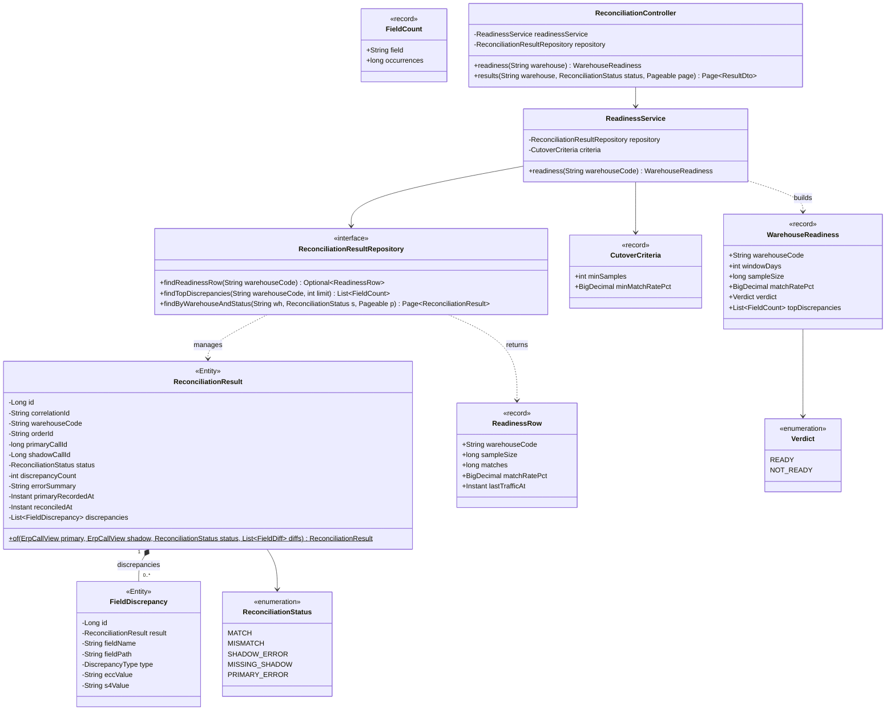
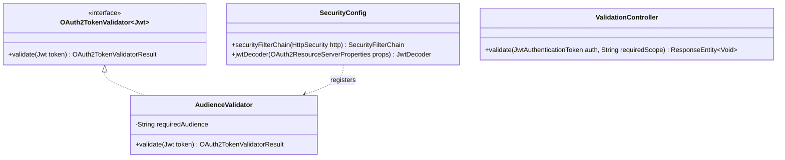
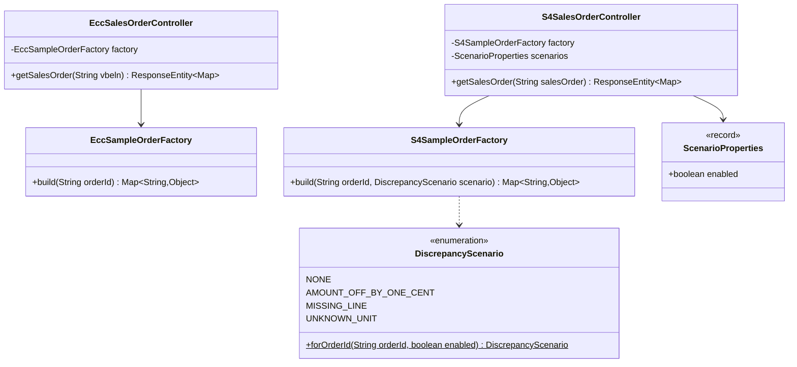

# ERP Migration Router — UML Class Design

> **Document 3 of 4** · [Architecture](01-architecture.md) · [Database schema](02-database-schema.md) · [UML class design](03-uml-class-design.md) ·
>
> Java 25 · Spring Boot 4 · Root package `com.bardaghji.erpmigration`

Notation: `<<record>>` = Java record, `<<Entity>>` = JPA entity, `+` public, `-` private,
`$` static. Getters, constructors and Spring annotations are omitted unless they carry design meaning.

---

## 1. Maven modules and dependencies



Two deliberate rules:

1. **Only `canonical-model` is shared.** It is the integration contract between the adapter (producer
   of canonical results) and reconciliation (consumer). Nothing else is shared — no "common utils" module.
2. **The mocks do not share DTOs with the adapter.** They represent external systems owned by someone
   else. If the adapter and the mocks used the same classes, a mapping bug could never show up as a
   contract mismatch — both sides would change together.

---

## 2. `canonical-model`



| Class | Package | Design notes |
|---|---|---|
| `CanonicalOrder`, `CanonicalOrderItem` | `…canonical` | Immutable records. The compact constructor sorts `items` by `lineNumber` and wraps them in `List.copyOf`, so two logically equal orders are always built identically. |
| `OrderStatus` | `…canonical` | No `UNKNOWN` value: an unrecognized ERP status is a mapping failure (`UNMAPPABLE`), not a valid canonical state. |
| `CanonicalSerializer` | `…canonical` | Deterministic JSON: `ORDER_MAP_ENTRIES_BY_KEYS`, `SORT_PROPERTIES_ALPHABETICALLY`, `BigDecimal` written as plain string after `stripTrailingZeros()`. Deterministic output is what makes `payload_hash` comparison valid. |
| `ErpSystem`, `CallMode`, `MigrationPhase`, `CallOutcome` | `…contract` | Values written to `integration.erp_call` and read back by reconciliation. Shared so both services agree on the codes. |

---

## 3. `order-adapter`

### 3.1 Request handling and ERP strategy



**Strategy pattern, selected by configuration.** Exactly one `ErpSourceAdapter` bean exists per
container:

```java
@Component
@ConditionalOnProperty(name = "adapter.erp-system", havingValue = "S4")
class S4SourceAdapter implements ErpSourceAdapter {  }
```

`adapter-ecc` runs with `adapter.erp-system=ECC`, `adapter-s4` with `S4`. The orchestration code
(`OrderIntegrationService`) never knows which ERP it talks to.

**`RequestContext.from(…)` validates the headers set by nginx** and rejects impossible combinations with
`400`: missing correlation ID, `X-Call-Mode: SHADOW` received by the ECC adapter, or `SHADOW` mode
with a phase other than `SHADOW`. These mirror the `ck_erp_call_shadow_consistency` database constraint,
so an inconsistent call fails at the door rather than at insert time.

**Orchestration** — the whole service method:

```java
public CanonicalOrder handle(RequestContext ctx) {
    long start = System.nanoTime();
    try {
        ErpFetchResult result = executor.execute(adapter.system(), ctx.mode(),
                () -> adapter.fetch(ctx.orderId()));
        recorder.recordSuccess(ctx, adapter.system(), result, elapsedMs(start));
        return result.order();
    } catch (IntegrationException ex) {
        recorder.recordFailure(ctx, adapter.system(), ex, elapsedMs(start));
        throw ex;                       // → GlobalExceptionHandler → Problem Details
    }
}
```

**`ResilientErpExecutor`** picks the breaker named `"<erp>-<mode>"` (`ecc-primary`, `s4-primary`,
`s4-shadow`) and, for `SHADOW` only, wraps the call in the `s4-shadow` bulkhead. It translates
Resilience4j exceptions into domain exceptions: `CallNotPermittedException` → `ErpUnavailableException`,
`BulkheadFullException` → `ShadowRejectedException`. Nothing outside this class imports Resilience4j.

### 3.2 ERP payloads and mapping



| Class | Notes |
|---|---|
| `EccSalesOrder` & items | Field names mapped with `@JsonProperty("VBELN")` etc. Everything is `String`, as SAP sends it; typing happens in the mapper, where failures can be reported precisely. |
| `S4SalesOrderResponse` / `S4ItemCollection` | Model the OData v2 envelope: the entity is wrapped in `d`, and the expanded navigation `to_Item` in `results`. |
| `EccOrderMapper`, `S4OrderMapper` | Pure functions of their input + the UoM table: no I/O except the cached lookup. Unit-tested with one test per row of the mapping table (architecture §9). Any parse failure throws `UnmappableOrderException` with the field name and raw value. |
| `S4OrderMapper.parseODataDate` | `"/Date(1789171200000)/"` → epoch millis → `LocalDate` in UTC. |
| `UomMappingService` | Caffeine cache, 60 s TTL. Unknown unit → `UnmappableOrderException("Unknown unit of measure 'KAR' for ERP S4")`. |

### 3.3 Persistence and error handling



| Exception | `outcome()` | HTTP (Problem Details) |
|---|---|---|
| `OrderNotFoundException` | `NOT_FOUND` | 404 |
| `UnmappableOrderException` | `UNMAPPABLE` | 422 |
| `ErpUnavailableException` | `ERP_UNAVAILABLE` | 503 |
| `ShadowRejectedException` | `REJECTED` | 503 (response discarded by nginx anyway) |

- `IntegrationException` extends `RuntimeException`; `rawPayload()` carries the ERP response when one
  was received (e.g. unmappable payload), so the failure row still holds the evidence.
- **`ErpCallRecorder` is best-effort:** it catches every persistence exception, logs it with the
  correlation ID and increments `erp_call_record_failures_total`. A duplicate
  `(correlation_id, erp_system)` — an nginx upstream retry — is caught as `DataIntegrityViolationException`
  and ignored. Recording must never change what the WMS receives.
- `ErpCall` exposes **static factories** instead of a public constructor + setters, so a success row
  without a payload (or a failure row with one) cannot be built — the same rule as the
  `ck_erp_call_success_payload` DB constraint, enforced first in Java.
- Enum fields use `@Enumerated(EnumType.STRING)`; `canonicalPayload` / `rawPayload` use
  `@JdbcTypeCode(SqlTypes.JSON)` over a `String`.

### 3.4 Package layout

```
com.bardaghji.erpmigration.adapter
├── api            OrderController, RequestContext, GlobalExceptionHandler
├── application    OrderIntegrationService, ErpFetchResult, exceptions
├── erp
│   ├── ErpSourceAdapter
│   ├── ecc        EccSourceAdapter, EccClient, EccSalesOrder*, EccOrderMapper
│   └── s4         S4SourceAdapter, S4Client, S4SalesOrder*, S4OrderMapper
├── mapping        SapFormats, UomMappingService
├── resilience     ResilientErpExecutor
└── persistence    ErpCall, ErpCallRepository, ErpCallRecorder, UomMapping*, UomMappingRepository
```

Dependency direction: `api → application → erp / resilience / persistence`. `erp.ecc` and `erp.s4`
never reference each other (checked with an ArchUnit test).

---

## 4. `reconciliation-service`

### 4.1 Reconciliation engine



- **`PendingCallReader` uses `JdbcClient`, not JPA.** It reads a table this service does not own
  (`integration.erp_call`); mapping it as a JPA entity would pretend to ownership and invite writes.
  A read-only view record + plain SQL (Q1 and Q2 in the database document) makes the contract explicit.
- **One transaction per reconciled request**, via `TransactionTemplate`. A `@Transactional` method
  called from inside the same class would bypass the Spring proxy and silently run without its own
  transaction. Per-item transactions mean one bad row never rolls back the whole batch, and a
  unique-key violation (overlapping runs) only skips that item.
- **Decision order in `reconcile`** (same as the architecture sequence diagram): primary failed →
  `PRIMARY_ERROR`; no shadow → `MISSING_SHADOW`; shadow failed → `SHADOW_ERROR`; equal hashes →
  `MATCH`; otherwise compare → `MISMATCH`.
- **`OrderComparator.compareItems`** indexes both lists by `lineNumber` (`Map<Integer, CanonicalOrderItem>`),
  then walks the union of keys: key only on ECC side → `MISSING_IN_S4`, only on S/4 side →
  `MISSING_IN_ECC`, both → compare `sku`, `quantity` (`compareTo`, not `equals`, so `2` = `2.000`), `unit`.
  O(n + m) instead of nested loops.
- `ReconciliationScheduler.runBatch()` uses `@Scheduled(fixedDelay = 15 s)` — *fixed delay*, not
  *fixed rate*, so a slow batch never overlaps the next one on the same instance.

### 4.2 Results and readiness



- `ReconciliationResult` ↔ `FieldDiscrepancy`: `@OneToMany(mappedBy = "result", cascade = ALL, orphanRemoval = true)`
  on the parent, `@ManyToOne(fetch = LAZY)` on the child. The `of(…)` factory sets
  `discrepancyCount = diffs.size()` itself, so the count can never disagree with the list
  (again mirroring a DB `CHECK`).
- `findReadinessRow` is a **native query on `v_warehouse_readiness`** mapped to the `ReadinessRow`
  record; `findTopDiscrepancies` is query Q3 of the database document.
- `CutoverCriteria` is a `@ConfigurationProperties("reconciliation.cutover-criteria")` record
  (`min-samples: 500`, `min-match-rate-pct: 99.5`), validated at start-up with `@Validated`.
- `ReadinessService.readiness(…)`: `READY` ⇔ `sampleSize ≥ minSamples` **and**
  `matchRatePct ≥ minMatchRatePct` (compared with `BigDecimal.compareTo`). Unknown warehouse
  (no rows) → `WarehouseNotFoundException` → `404`.
- `results(…)` returns `ResultDto` records, never entities, to avoid lazy-loading and exposing JPA
  internals through the API.

---

## 5. `auth-validator`



| Case | Handled by | Response to nginx |
|---|---|---|
| No / malformed / expired / badly signed token | Spring Security filter chain (`BearerTokenAuthenticationEntryPoint`) — controller never reached | `401` |
| Wrong audience or issuer | `JwtDecoder` validators (issuer + `AudienceValidator`) | `401` |
| Valid token, scope in `X-Required-Scope` missing from `scope` claim | `ValidationController` | `403` |
| Valid token with scope | `ValidationController` | `204` + `X-Client-Id` (from `azp` claim) |

`JwtDecoder` is built from Keycloak's **JWKS URI on the internal hostname**
(`http://keycloak:8080/realms/erp-migration/protocol/openid-connect/certs`) and validates the issuer
against the **external hostname** (`http://localhost:8180/realms/erp-migration`). Clients obtain tokens
through `localhost:8180`, so that is the `iss` claim; building the decoder from an issuer URI with the
internal hostname would reject every token with an issuer mismatch. The JWKS is fetched once and cached,
so validating a request needs no network call to Keycloak. `X-Required-Scope` is trusted because only nginx can reach
this service.

---

## 6. ERP mocks



| Mock | Endpoint | Shape |
|---|---|---|
| `mock-ecc` | `GET /sap/ecc/salesorders/{vbeln}` | Flat ECC JSON: `VBELN`, `KUNNR`, `AUDAT`, `NETWR`, `WAERK`, `GBSTK`, `ITEMS[]` (`POSNR`, `MATNR`, `KWMENG`, `VRKME`) |
| `mock-s4` | `GET /sap/opu/odata/sap/API_SALES_ORDER_SRV/A_SalesOrder('{id}')?$expand=to_Item` | OData v2 envelope `{ "d": { …, "to_Item": { "results": [ … ] } } }` |

- Both mocks build plain `Map` JSON on purpose: they are "someone else's system" and do not share or
  mirror the adapter's DTO classes.
- Both return `404` for order IDs starting with `99`, to exercise the adapter's `NOT_FOUND` path.
- `DiscrepancyScenario.forOrderId` implements the seeded-scenario table of the architecture document
  (§8.4): last digit `7` → amount +0.01, `8` → missing line, `9` → unit `KAR`; everything else `NONE`.
  With `mock.s4.scenarios.enabled=false` it always returns `NONE`.

---

## 7. Design patterns summary

| Pattern | Where | Why |
|---|---|---|
| Strategy | `ErpSourceAdapter` + `@ConditionalOnProperty` | One orchestration, pluggable ERP |
| Adapter / Mapper | `EccOrderMapper`, `S4OrderMapper` | Isolate each ERP's vocabulary from the canonical model |
| Canonical Data Model | `canonical-model` module | Consumers and reconciliation depend on one model, not on N ERP formats |
| Static factory methods | `ErpCall.success/failure`, `ReconciliationResult.of` | Make invalid states unconstructible |
| Circuit Breaker + Bulkhead | `ResilientErpExecutor` | Isolate shadow experiments from live S/4 traffic |
| Repository / read model | JPA repositories; `PendingCallReader` + `ErpCallView` | Own data via JPA, foreign data via explicit read-only SQL |
| Strangler Fig | nginx routing table | Migrate warehouse by warehouse behind a stable API |
| Parallel Run (shadow traffic) | nginx `mirror` + reconciliation | Prove equivalence on real traffic before cutover |
