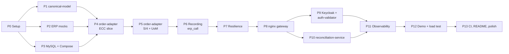

# ERP Migration Router — Development Plan

> **Document 4 of 4** · [Architecture](01-architecture.md) · [Database schema](02-database-schema.md) · [UML class design](03-uml-class-design.md) · [Development plan](04-development-plan.md)
>
> How to read this plan: phases are in build order. Every step lists **what to do**, **what to check**,
> and a **done when** condition. Do not start a step until the previous step's *done when* is true.
> Commit at the end of every step (message suggested in each step).

---

## How the phases fit together



### Effort estimate

| Phase | Evenings (≈ 2–3 h each) |
|---|---|
| P0 Setup | 1 |
| P1 canonical-model | 1 |
| P2 ERP mocks | 1.5 |
| P3 MySQL + Compose | 0.5 |
| P4 order-adapter, ECC slice | 2 |
| P5 order-adapter, S/4 + UoM | 1 |
| P6 Recording | 1.5 |
| P7 Resilience | 1 |
| P8 nginx gateway | 1.5 |
| P9 Keycloak + auth-validator | 1.5 |
| P10 reconciliation-service | 2.5 |
| P11 Observability | 1 |
| P12 Demo + load test | 1 |
| P13 CI, README, polish | 1 |
| **Total** | **≈ 18 evenings** |

**Cut line if time runs short:** P0–P8 + P10 is the minimum that tells the migration story (routing,
shadow traffic, reconciliation, readiness). P9 (inbound auth) and P11 (Grafana) can move to a v1.1 without
breaking anything, because nginx routes and database tables do not change.

### Conventions used in every step

| Item | Convention |
|---|---|
| Root package | `com.bardaghji.erpmigration.<module>` (e.g. `…adapter`, `…reconciliation`) |
| Internal container port | `8080` for every Spring Boot service |
| Correlation ID for manual tests | any 32 lowercase hex characters, e.g. `aaaaaaaaaaaaaaaaaaaaaaaaaaaaaa01` |
| Test warehouses | `FR01`, `FR02` = CUTOVER · `BE01`, `BE02` = SHADOW · `DE01` = LEGACY |
| Order IDs | any 1–10 digits; last digit `7`/`8`/`9` triggers S/4 discrepancies; IDs starting with `99` → 404 |
| Commit messages | Conventional commits: `feat(adapter): …`, `test(recon): …`, `chore: …`, `docs: …` |

---

## P0 — Project setup

### 0.1 Install and check the toolchain

- JDK **25** (Temurin), Maven **3.9+**, Docker Desktop with Compose v2, `git`, `curl`, `jq`, `mkcert`.
- Check: `java -version` shows 25, `mvn -v` shows the same JDK, `docker compose version` works.

**Done when** all five commands print versions without error.

### 0.2 Create the repository

```
erp-migration-router/
├── docs/                       ← copy the 4 design documents here now
├── .gitignore                  ← target/, .idea/, *.iml, .env, gateway/certs/
├── .env.example                ← every secret with a placeholder value
└── README.md                   ← one paragraph + "work in progress"
```

`.env.example` (fill `.env` locally, never commit it):

```properties
MYSQL_ROOT_PASSWORD=change-me
ADAPTER_DB_PASSWORD=change-me
RECON_DB_PASSWORD=change-me
KEYCLOAK_ADMIN_PASSWORD=change-me
WMS_CLIENT_SECRET=change-me
OPS_CLIENT_SECRET=change-me
```

Commit: `chore: initial repository with design docs`

### 0.3 Maven parent POM

Create `pom.xml` at the root:

- `<parent>` = `org.springframework.boot:spring-boot-starter-parent`, latest **4.0.x**.
- `<packaging>pom</packaging>`, `<java.version>25</java.version>`.
- `<modules>`: `canonical-model`, `mock-ecc`, `mock-s4`, `order-adapter`, `auth-validator`,
  `reconciliation-service` (create empty module folders now, each with its own `pom.xml` whose parent is the root).
- `<dependencyManagement>`: `canonical-model` (`${project.version}`), Resilience4j BOM, Testcontainers BOM,
  ArchUnit (`com.tngtech.archunit:archunit-junit5`).

**Pitfall — Spring Boot 4 specifics you will meet:**

| Topic | What changed | What to do |
|---|---|---|
| Jackson | Boot 4 uses **Jackson 3**: classes live in `tools.jackson.*` (e.g. `tools.jackson.databind.json.JsonMapper`). Annotations stay in `com.fasterxml.jackson.annotation`. | Import from `tools.jackson` for mappers; do not add Jackson 2 by hand. |
| Starters | Boot 4 split auto-configuration into modules. | Use the dedicated starters (e.g. `spring-boot-starter-flyway`) rather than only the library jar. If a feature does not auto-configure, check that its starter is present first. |
| Resilience4j | Its Spring Boot starter may lag behind Boot 4. | Use the **core modules** (`resilience4j-circuitbreaker`, `resilience4j-bulkhead`, `resilience4j-micrometer`) and declare registries as beans yourself (step 7.1). This matches the design: `ResilientErpExecutor` already owns the registries. |

Check: `mvn -q validate` at the root succeeds.

Commit: `chore: maven multi-module skeleton`

### 0.4 One Dockerfile for all Spring Boot modules

`Dockerfile` at the root, used by every Java service with a build argument:

```dockerfile
FROM maven:3.9-eclipse-temurin-25 AS build
WORKDIR /src
COPY . .
ARG MODULE
RUN mvn -B -q -pl ${MODULE} -am package -DskipTests

FROM eclipse-temurin:25-jre
ARG MODULE
WORKDIR /app
COPY --from=build /src/${MODULE}/target/*.jar app.jar
EXPOSE 8080
ENTRYPOINT ["java", "-jar", "/app/app.jar"]
```

- `-pl ${MODULE} -am` builds the module **and** the modules it depends on (`canonical-model`).
- Check that the JRE image has `curl` (needed for Compose health checks):
  `docker run --rm eclipse-temurin:25-jre sh -c "command -v curl"`. If nothing prints, add
  `RUN apt-get update && apt-get install -y --no-install-recommends curl && rm -rf /var/lib/apt/lists/*`.
- Add a `.dockerignore`: `**/target`, `.git`, `.idea`, `gateway/certs`.

**Done when** the file exists; it is tested in P2.

Commit: `chore: shared multi-stage Dockerfile`

---

## P1 — `canonical-model` (plain Java library)

Dependencies: `jackson-databind` (Jackson 3, managed by the Boot BOM), JUnit 5 + AssertJ (test).
No Spring dependency: this is a library. Add the `spring-boot-maven-plugin` **skip** (`<skip>true</skip>`)
or simply do not declare it, so the jar stays a normal library jar.

### 1.1 Records and enums

Create, exactly as in UML §2:

- `…canonical.CanonicalOrder` (record), `CanonicalOrderItem` (record), `OrderStatus` (enum).
- `…contract.ErpSystem`, `CallMode`, `MigrationPhase`, `CallOutcome` (enums).

`CanonicalOrder` compact constructor:

```java
public CanonicalOrder {
    Objects.requireNonNull(orderId, "orderId");
    // … same for other fields
    items = items.stream()
                 .sorted(Comparator.comparingInt(CanonicalOrderItem::lineNumber))
                 .toList();          // toList() is already unmodifiable
}
```

### 1.2 `CanonicalSerializer`

- Build one `JsonMapper` with: sorted properties (`MapperFeature.SORT_PROPERTIES_ALPHABETICALLY`),
  sorted map keys (`SerializationFeature.ORDER_MAP_ENTRIES_BY_KEYS`), dates as ISO strings
  (not timestamps), `BigDecimal` written as plain string.
- Before serializing, normalize decimals: `value.stripTrailingZeros().toPlainString()`.
  Easiest: a custom serializer for `BigDecimal` registered in a `SimpleModule`.
- `sha256Hex(String json)`: `MessageDigest.getInstance("SHA-256")` on UTF-8 bytes → `HexFormat.of().formatHex(...)`.

### 1.3 Tests (the important part of this module)

`CanonicalSerializerTest`:

1. Same order built twice → identical JSON and identical hash.
2. Items given in order `[20, 10]` vs `[10, 20]` → identical JSON.
3. `new BigDecimal("2.000")` vs `new BigDecimal("2")` → identical JSON.
4. Round trip `fromJson(toJson(order))` equals `order`.
5. Different `totalAmount` → different hash.

Check: `mvn -pl canonical-model test` is green.

**Done when** the five tests pass. Commit: `feat(canonical): canonical model with deterministic serialization`

---

## P2 — ERP mocks

Both mocks are tiny Spring Boot web apps (`spring-boot-starter-web` + `actuator`). They must **not**
depend on `canonical-model` (UML §1, rule 2).

### 2.1 The shared sample-data recipe (write it in both mocks, do not share code)

Both mocks must describe the **same business order** for a given ID, otherwise nothing would ever match.
Implement this recipe separately in each factory (`n` = order ID as a `long`):

| Business field | Rule |
|---|---|
| Customer | `100000 + (n % 1000)` |
| Order date | `2026-09-01` plus `(n % 28)` days |
| Status | `n % 3` → `0 = A`, `1 = B`, `2 = C` |
| Currency | `EUR` |
| Number of lines | `1 + (n % 3)` |
| Line number *i* (1-based) | `10 × i` |
| SKU | `"MAT-" + String.format("%03d", i)` |
| Quantity | `i + 1` |
| Unit price (not sent) | `25.00` |
| Total net amount | `Σ quantity × 25.00` |
| Unit of measure | ECC `EA` / S/4 `ST`; **if `n` ends with 9**, carton order: ECC `CT` / S/4 `KAR` |

**404 rule (both mocks):** order IDs starting with `99` return `404`.

### 2.2 `mock-ecc`

- `GET /sap/ecc/salesorders/{vbeln}` → flat ECC JSON, **SAP formatting**:
  `VBELN` zero-padded to 10 digits, `KUNNR` zero-padded to 10, `AUDAT` as `yyyyMMdd`,
  `NETWR` as `"150.00"`, `POSNR` zero-padded to 6 (`"000010"`), `KWMENG` with 3 decimals (`"2.000"`).
- Build the response as a `Map<String, Object>` (`LinkedHashMap` to keep field order readable).

Example for `vbeln = 4500123` (n % 3 = 0 → 1 line, status A):

```json
{ "VBELN": "0004500123", "KUNNR": "0000100123", "AUDAT": "20260920", "NETWR": "50.00",
  "WAERK": "EUR", "GBSTK": "A",
  "ITEMS": [ { "POSNR": "000010", "MATNR": "MAT-001", "KWMENG": "2.000", "VRKME": "EA" } ] }
```

*(Check the arithmetic yourself in a unit test — that is the point of the recipe.)*

### 2.3 `mock-s4`

- `GET /sap/opu/odata/sap/API_SALES_ORDER_SRV/A_SalesOrder('{id}')` with `$expand=to_Item`.
- OData v2 envelope: `{ "d": { "SalesOrder": "4500123", …, "to_Item": { "results": [ … ] } } }`.
- **S/4 formatting**: no leading zeros, `SalesOrderDate` = `"/Date(<epoch millis at UTC midnight>)/"`,
  `RequestedQuantity` without trailing zeros (`"2"`), unit `ST` instead of `EA`.
- `ScenarioProperties` record bound to `mock.s4.scenarios.enabled` (default `true`).
- `DiscrepancyScenario.forOrderId(id, enabled)` per last digit: `7` → `TotalNetAmount` + 0.01,
  `8` → drop the **last** item line, `9` → unit `KAR` (the carton order). Other digits → `NONE`.
  `MISSING_LINE` applies only when the order has **2 or more lines** (e.g. `4500118`, `4500128`); for a
  one-line order such as `4500108` it falls back to `NONE`, so S/4 never returns an order without items.

**Pitfall — the path with quotes and parentheses.** Spring's path matching accepts literal text around
a variable inside a segment: `@GetMapping("/sap/opu/odata/sap/API_SALES_ORDER_SRV/A_SalesOrder('{id}')")`.
Test it with curl first. If it does not match, use a regex variable such as `A_SalesOrder{key:\\('\\d+'\\)}`
and strip the quotes in code.

### 2.4 Tests and containers

- One `@WebMvcTest` per mock: happy path fields, 404 for `99…`, and (S/4) each scenario.
- Add both to a first `docker-compose.yml`:

```yaml
services:
  mock-ecc:
    build: { context: ., args: { MODULE: mock-ecc } }
    healthcheck: { test: ["CMD", "curl", "-f", "http://localhost:8080/actuator/health"], interval: 5s, retries: 20 }
  mock-s4:
    build: { context: ., args: { MODULE: mock-s4 } }
    environment: { MOCK_S4_SCENARIOS_ENABLED: "true" }
    healthcheck: { test: ["CMD", "curl", "-f", "http://localhost:8080/actuator/health"], interval: 5s, retries: 20 }
```

- Create `compose.dev.yml` that **only publishes ports** for manual testing during development
  (the final setup publishes only nginx, Keycloak and Grafana):

```yaml
services:
  mock-ecc: { ports: ["9001:8080"] }
  mock-s4:  { ports: ["9002:8080"] }
```

Check:

```bash
docker compose -f docker-compose.yml -f compose.dev.yml up --build -d mock-ecc mock-s4
curl -s localhost:9001/sap/ecc/salesorders/4500123 | jq
curl -s "localhost:9002/sap/opu/odata/sap/API_SALES_ORDER_SRV/A_SalesOrder('4500123')?\$expand=to_Item" | jq
```

**Done when** both return the same business order in their own format, and `…127` shows a different
S/4 total. Commit: `feat(mocks): ECC and S/4 sales order mocks with seeded discrepancies`

---

## P3 — MySQL in Compose

### 3.1 Init script

`mysql/init/01-init.sh` (**shell**, not `.sql` — see database doc §8):

```bash
#!/bin/bash
set -e
mysql -uroot -p"$MYSQL_ROOT_PASSWORD" <<SQL
CREATE DATABASE IF NOT EXISTS integration    CHARACTER SET utf8mb4 COLLATE utf8mb4_0900_ai_ci;
CREATE DATABASE IF NOT EXISTS reconciliation CHARACTER SET utf8mb4 COLLATE utf8mb4_0900_ai_ci;
CREATE USER IF NOT EXISTS 'adapter_app'@'%' IDENTIFIED BY '${ADAPTER_DB_PASSWORD}';
GRANT ALL PRIVILEGES ON integration.* TO 'adapter_app'@'%';
CREATE USER IF NOT EXISTS 'recon_app'@'%' IDENTIFIED BY '${RECON_DB_PASSWORD}';
GRANT ALL PRIVILEGES ON reconciliation.*     TO 'recon_app'@'%';
GRANT SELECT         ON integration.erp_call TO 'recon_app'@'%';
SQL
```

**Pitfall:** `GRANT SELECT ON integration.erp_call` fails if the table does not exist yet, and it does
not exist until Flyway runs in P6. Two options — pick one and note it in the README:
(a) grant `SELECT ON integration.*` (simpler, slightly broader), or
(b) keep the table-level grant but run it in a later step (e.g. a small SQL executed after the adapter's first start).
**Recommended: (a) for v1**, documented as a known simplification.

Make the script executable: `chmod +x mysql/init/01-init.sh` (and commit the executable bit:
`git update-index --chmod=+x mysql/init/01-init.sh` on Windows).

### 3.2 Compose service

```yaml
  mysql:
    image: mysql:8.4
    environment:
      MYSQL_ROOT_PASSWORD: ${MYSQL_ROOT_PASSWORD}
      ADAPTER_DB_PASSWORD: ${ADAPTER_DB_PASSWORD}
      RECON_DB_PASSWORD: ${RECON_DB_PASSWORD}
    volumes:
      - mysql-data:/var/lib/mysql
      - ./mysql/init:/docker-entrypoint-initdb.d:ro
    healthcheck:
      test: ["CMD", "mysqladmin", "ping", "-h", "localhost", "-p${MYSQL_ROOT_PASSWORD}"]
      interval: 5s
      retries: 20
volumes:
  mysql-data:
```

**Pitfall:** init scripts run **only when the volume is empty**. After changing the script:
`docker compose down -v` then up again.

Check: `docker compose exec mysql mysql -uadapter_app -p -e "SHOW DATABASES;"` lists `integration`.

**Done when** both users can log in and see their database. Commit: `chore(db): mysql service with schemas and users`

---

## P4 — `order-adapter`, ECC vertical slice (no database yet)

Goal: `GET /internal/orders/{wh}/{orderId}` on `adapter-ecc` returns a canonical order from `mock-ecc`.
Dependencies: `web`, `actuator`, `validation`, `canonical-model`. (Data JPA and Flyway come in P5/P6.)

### 4.1 Configuration

`application.yml`:

```yaml
adapter:
  erp-system: ECC                    # overridden to S4 by the adapter-s4 container
erp:
  ecc: { base-url: http://mock-ecc:8080 }
  s4:  { base-url: http://mock-s4:8080 }
  timeouts: { connect: 1s, read: 2s }
```

Bind with a `@ConfigurationProperties("erp")` record. Build each `RestClient` in a `@Configuration` with an
explicit request factory so timeouts are visible in code (e.g. `JdkClientHttpRequestFactory` with
`HttpClient.newBuilder().connectTimeout(...)` and `setReadTimeout(...)`).

### 4.2 `RequestContext` and header validation

- Controller signature: `@GetMapping("/internal/orders/{warehouseCode}/{orderId}")` with
  `@RequestHeader("X-Correlation-Id")`, `X-Migration-Phase`, `X-Call-Mode`, optional `X-Client-Id`.
- `RequestContext.from(...)` rejects with `InvalidRequestContextException` (→ `400`):
  correlation ID not matching `[0-9a-f]{32}`; warehouse not `[A-Z0-9]{4}`; order ID not `[0-9]{1,10}`;
  `SHADOW` mode on the ECC adapter; `SHADOW` mode with a phase other than `SHADOW`.
- Unit-test every rejection rule (one test each).

### 4.3 ECC client, payload records, mapper

- `EccSalesOrder` / `EccSalesOrderItem` records with `@JsonProperty("VBELN")` etc. All fields `String`.
- `EccClient.getSalesOrder(orderId)`: `404` → `OrderNotFoundException`; connection error / timeout / `5xx`
  → `ErpUnavailableException`. Use `RestClient`'s `onStatus(...)` for status handling and catch
  `ResourceAccessException` for I/O errors.
- `SapFormats` utility: `stripLeadingZeros`, `parseDecimal`, `parseLineNumber`, `parseSapDate`.
- `EccOrderMapper.toCanonical(...)`. For now, map units with a temporary `Map.of("EA","EA","CT","CT","PAL","PAL")`;
  it becomes `UomMappingService` in P5. Any parse error → `UnmappableOrderException(field, rawValue)`.

**Mapper tests:** one test per row of the mapping table (architecture §9), plus: unknown `GBSTK` → unmappable,
malformed date → unmappable, `"2.000"` → `BigDecimal` equal to `2` (compare with `isEqualByComparingTo`).

### 4.4 `ErpSourceAdapter` + `OrderIntegrationService` (without recorder/executor yet)

- `EccSourceAdapter` annotated `@ConditionalOnProperty(name = "adapter.erp-system", havingValue = "ECC")`.
- `ErpFetchResult(rawPayload, order)`: keep the raw JSON string. Easiest: have the client return the body as
  `String`, then parse it with the `JsonMapper` into the record, so you have both.
- `OrderIntegrationService.handle(ctx)` calls `adapter.fetch(...)` directly for now.

### 4.5 Errors as Problem Details

- `GlobalExceptionHandler` (`@RestControllerAdvice`) builds `ProblemDetail` with `type`, `title`, `status`,
  `detail`, and property `correlationId` (from the request header).
- Map: `OrderNotFound` 404, `Unmappable` 422, `ErpUnavailable` 503, `ShadowRejected` 503,
  `InvalidRequestContext` 400.

### 4.6 Run it

Add `adapter-ecc` to Compose (`MODULE: order-adapter`, env `ADAPTER_ERP_SYSTEM: ECC`, depends on `mock-ecc`
healthy) and publish `9081:8080` in `compose.dev.yml`.

```bash
curl -s localhost:9081/internal/orders/DE01/4500123 \
  -H "X-Correlation-Id: aaaaaaaaaaaaaaaaaaaaaaaaaaaaaa01" \
  -H "X-Migration-Phase: LEGACY" -H "X-Call-Mode: PRIMARY" | jq
curl -si localhost:9081/internal/orders/DE01/9900001 -H "X-Correlation-Id: aaaaaaaaaaaaaaaaaaaaaaaaaaaaaa02" \
  -H "X-Migration-Phase: LEGACY" -H "X-Call-Mode: PRIMARY"          # expect 404 problem+json
```

**Done when** happy path returns canonical JSON, 404 and 400 return Problem Details with the correlation ID.
Commit: `feat(adapter): ECC source adapter with canonical mapping`

---

## P5 — `order-adapter`, S/4 strategy and UoM table

### 5.1 Database access for UoM

- Add `spring-boot-starter-data-jpa`, `spring-boot-starter-flyway`, `flyway-mysql`, `mysql-connector-j`.
- Datasource: `jdbc:mysql://mysql:3306/integration?connectionTimeZone=UTC`, user `adapter_app`.
- `spring.jpa.hibernate.ddl-auto=validate` (Flyway creates tables, Hibernate only checks them).
- Flyway: create **both** `V1__create_erp_call.sql` and `V2__create_and_seed_uom_mapping.sql` now, copied from
  the database document. (Creating `erp_call` now avoids renumbering migrations later.)

### 5.2 `UomMappingService`

- Entity `UomMapping` with `@EmbeddedId UomMappingId` — note: `@EmbeddedId` needs a class annotated
  `@Embeddable`; a record works as embeddable with recent Hibernate, but if you hit issues use a small final class.
- Cache: Caffeine (`com.github.ben-manes.caffeine:caffeine`), `expireAfterWrite(60 s)`, key = `(erp, sourceUnit)`.
  Do not cache "not found" results, so a newly inserted row is picked up quickly.
- Replace the temporary map from 4.3 in `EccOrderMapper`.

### 5.3 S/4 adapter

- `S4SalesOrderResponse` → `S4SalesOrder` → `S4ItemCollection` → `S4SalesOrderItem` records
  (`@JsonProperty("SalesOrder")`, `@JsonProperty("to_Item")`, `@JsonProperty("results")` …).
- `S4Client` URL: `/sap/opu/odata/sap/API_SALES_ORDER_SRV/A_SalesOrder('{id}')?$expand=to_Item`.
- `S4OrderMapper.parseODataDate`: regex `^/Date\((-?\d+)\)/$` → `Instant.ofEpochMilli` → `LocalDate.ofInstant(..., UTC)`.
- `S4SourceAdapter` with `@ConditionalOnProperty(... havingValue = "S4")`.
- Tests: same style as ECC; plus `KAR` → unmappable; and a **cross-mapper test**: ECC JSON and S/4 JSON
  of the same order (copy them from the running mocks into `src/test/resources`) produce **equal**
  canonical orders and equal hashes. This single test proves your mappings agree.

### 5.4 Two containers from one image

Add `adapter-s4` to Compose: same build, `ADAPTER_ERP_SYSTEM: S4`, `SPRING_FLYWAY_ENABLED: "false"`,
`depends_on: adapter-ecc: condition: service_healthy`. `adapter-ecc` gets `depends_on: mysql` healthy and runs Flyway.
Publish `9082:8080` for `adapter-s4` in `compose.dev.yml`.

Check: call both adapters for order `4500123` → identical canonical JSON. Order `4500129` on `adapter-s4` → 422.

**Done when** the cross-mapper test passes and both containers answer. Commit: `feat(adapter): S/4 source adapter and UoM mapping table`

---

## P6 — Recording every call in `erp_call`

### 6.1 Entity and repository

- `ErpCall` entity per UML §3.3: enums with `@Enumerated(EnumType.STRING)`; JSON columns with
  `@JdbcTypeCode(SqlTypes.JSON)` on `String` fields; `createdAt` set by the DB default
  (`@Column(insertable = false, updatable = false)`) or set in the factory with `Instant.now()` — choose one.
- **No public setters.** Static factories `success(...)` and `failure(...)`; a `protected` no-arg constructor for JPA.

### 6.2 `ErpCallRecorder` (best-effort)

- `recordSuccess`: serialize the canonical order with `CanonicalSerializer`, hash it, save.
- `recordFailure`: outcome from `ex.outcome()`, `errorCode` = exception simple name, truncated `errorMessage`
  (≤ 1000 chars), raw payload if the exception carries it.
- Wrap each save in `try/catch (DataIntegrityViolationException e)` → log "duplicate, ignored";
  `catch (RuntimeException e)` → log error with correlation ID + increment counter `erp.call.record.failures`.
  **Never rethrow.**
- **Pitfall:** `repository.save()` inside a method without its own transaction flushes at commit; to catch the
  duplicate-key error *inside* the recorder, use `saveAndFlush(...)`.

### 6.3 Wire into `OrderIntegrationService`

Use the exact orchestration code from UML §3.1 (timer start, try/catch, record success or failure, rethrow).

### 6.4 Integration test with Testcontainers

- `@SpringBootTest` + `@Testcontainers` + MySQL container with `@ServiceConnection`; the ERP is replaced by
  a `MockRestServiceServer` or WireMock.
- Tests: success writes one row with hash; 404 writes a `NOT_FOUND` row with null payload; two calls with the
  same correlation ID write **one** row and both return 200; a stopped DB does not change the HTTP 200
  (optional, harder — you can instead mock the repository to throw).

Check manually: call the adapter, then
`docker compose exec mysql mysql -uadapter_app -p integration -e "SELECT correlation_id, erp_system, call_mode, outcome, payload_hash FROM erp_call;"`

**Done when** tests pass and rows appear. Commit: `feat(adapter): record every ERP call with canonical hash`

---

## P7 — Resilience

### 7.1 Registries

- Beans: `CircuitBreakerRegistry` with a default config (sliding window 20 calls, failure rate 50 %,
  wait in open state 10 s, half-open 3 calls) and `BulkheadRegistry` with `s4-shadow` = max 10 concurrent,
  max wait 0 ms.
- **Only availability failures open the breaker:** `recordExceptions(ErpUnavailableException.class)`.
  A `404` or an unmappable order says nothing about the ERP's health — if those counted, a batch of bad order IDs
  would cut off a healthy ERP.
- Bind breaker metrics to Micrometer with `TaggedCircuitBreakerMetrics.ofCircuitBreakerRegistry(registry).bindTo(meterRegistry)`.

### 7.2 `ResilientErpExecutor`

- Name = `erp.name().toLowerCase() + "-" + mode.name().toLowerCase()` → `ecc-primary`, `s4-primary`, `s4-shadow`.
- `SHADOW` → decorate with bulkhead then breaker; `PRIMARY` → breaker only.
- Translate `CallNotPermittedException` → `ErpUnavailableException("circuit open")`,
  `BulkheadFullException` → `ShadowRejectedException`.

### 7.3 Tests

- Unit test with a supplier that always throws `ErpUnavailableException`: after 20 calls, the next call gets
  "circuit open" without invoking the supplier (assert with a counter).
- Failures on `s4-shadow` do **not** open `s4-primary` (the key design claim — write this test).
- 404s never open the breaker.

**Done when** the three tests pass. Commit: `feat(adapter): per-mode circuit breakers and shadow bulkhead`

---

## P8 — nginx gateway

### 8.1 Local TLS certificate

```bash
mkcert -install
mkdir -p gateway/certs
mkcert -cert-file gateway/certs/localhost.pem -key-file gateway/certs/localhost-key.pem localhost 127.0.0.1
```

(`gateway/certs` is git-ignored; document the command in the README.)

### 8.2 Configuration files

- `gateway/conf/migration-waves.conf`: the two `map` blocks from architecture §6.1.
- `gateway/conf/nginx.conf`: `events {}`, `http { … }` containing: `log_format json_access` (§6.4),
  `access_log /dev/stdout json_access;`, the `$wh_code` / `$order_id` maps (§6.2), `include migration-waves.conf;`,
  upstreams, `limit_req_zone`, and the `server` block from §6.2.
- **For now, comment out the `auth_request` and `auth_request_set` lines** — auth arrives in P9.
  Set `$client_id` to empty with `set $client_id "";` inside the order location so the log format still works.
- Add `ssl_certificate /etc/nginx/certs/localhost.pem; ssl_certificate_key /etc/nginx/certs/localhost-key.pem;`.

Compose:

```yaml
  nginx-gateway:
    image: nginx:1.27-alpine
    ports: ["8443:8443"]
    volumes:
      - ./gateway/conf/nginx.conf:/etc/nginx/nginx.conf:ro
      - ./gateway/conf/migration-waves.conf:/etc/nginx/migration-waves.conf:ro
      - ./gateway/certs:/etc/nginx/certs:ro
    depends_on:
      adapter-ecc: { condition: service_healthy }
      adapter-s4:  { condition: service_healthy }
```

**Pitfalls:**

- nginx resolves upstream hostnames **at start-up**; if a container is not running, nginx refuses to start
  ("host not found in upstream"). That is why `depends_on … service_healthy` matters.
- Mounting a single file with `:ro` means an editor that replaces the file (new inode) may not be seen by the
  container. If `nginx -s reload` does not pick up a change, mount the whole `gateway/conf` folder instead.
- Always run `docker compose exec nginx-gateway nginx -t` before a reload.

### 8.3 Scenario checks (write them as `scripts/check-routing.sh`)

```bash
BASE=https://localhost:8443/api/v1/warehouses
curl -s $BASE/DE01/orders/4500123 | jq .orderId     # LEGACY → ECC only
curl -s $BASE/BE01/orders/4500123 | jq .orderId     # SHADOW → ECC answers, S/4 mirrored
curl -s $BASE/FR01/orders/4500123 | jq .orderId     # CUTOVER → S/4 only
curl -si $BASE/BE01/orders/ABC                       # 404 from nginx (regex rejects)
```

Then verify in the database:

```sql
SELECT correlation_id, erp_system, call_mode, migration_phase FROM erp_call ORDER BY id DESC LIMIT 5;
```

Expected: DE01 → one ECC row; BE01 → **two rows with the same correlation ID** (ECC PRIMARY + S4 SHADOW);
FR01 → one S4 PRIMARY row.

### 8.4 Cutover and rollback drill

1. Change `BE01 SHADOW;` → `BE01 CUTOVER;`, run `nginx -t` then `nginx -s reload` inside the container.
2. Call BE01 again → one S4 PRIMARY row. Revert, reload, call → back to two rows.
3. Note the commands in `scripts/cutover.sh <WH> <PHASE>` (uses `sed` + `nginx -t` + reload, refuses to reload if the test fails).

### 8.5 Remove dev ports

Stop using `compose.dev.yml` from here on: everything goes through `https://localhost:8443`.

**Done when** all four scenarios and the drill behave as expected. Commit: `feat(gateway): nginx per-warehouse routing and shadow mirroring`

---

## P9 — Keycloak and `auth-validator`

### 9.1 Keycloak container

```yaml
  keycloak:
    image: quay.io/keycloak/keycloak:26.0
    command: ["start-dev", "--import-realm"]
    environment:
      KC_BOOTSTRAP_ADMIN_USERNAME: admin
      KC_BOOTSTRAP_ADMIN_PASSWORD: ${KEYCLOAK_ADMIN_PASSWORD}
      KC_HOSTNAME: http://localhost:8180
      KC_HOSTNAME_BACKCHANNEL_DYNAMIC: "true"
      KC_HEALTH_ENABLED: "true"
      WMS_CLIENT_SECRET: ${WMS_CLIENT_SECRET}
      OPS_CLIENT_SECRET: ${OPS_CLIENT_SECRET}
    ports: ["8180:8080"]
    volumes: ["./keycloak:/opt/keycloak/data/import:ro"]
```

- `KC_HOSTNAME` fixes the token issuer to `http://localhost:8180/realms/erp-migration`, whichever network the
  token request came from. `KC_HOSTNAME_BACKCHANNEL_DYNAMIC` lets containers still reach Keycloak as `keycloak:8080`.
- Health endpoint: in Keycloak 25+, health is on the **management port 9000** (`/health/ready`), not 8080.
  Use that in the Compose health check.
- **Pitfall:** the Keycloak image has **no `curl`**. Use bash's TCP redirection as the health check:
  `["CMD-SHELL", "exec 3<>/dev/tcp/localhost/9000 && printf 'GET /health/ready HTTP/1.1\\r\\nHost: localhost\\r\\nConnection: close\\r\\n\\r\\n' >&3 && grep -q UP <&3"]`.
- Use the latest 26.x tag you find; check the env var names against that version's docs if start-up complains.

### 9.2 Realm file `keycloak/realm-export.json`

Start from this template (Keycloak replaces `${ENV}` placeholders at import):

```json
{
  "realm": "erp-migration",
  "enabled": true,
  "accessTokenLifespan": 300,
  "clientScopes": [
    { "name": "orders.read", "protocol": "openid-connect",
      "attributes": { "include.in.token.scope": "true" } },
    { "name": "reconciliation.read", "protocol": "openid-connect",
      "attributes": { "include.in.token.scope": "true" } },
    { "name": "erp-migration-api-audience", "protocol": "openid-connect",
      "protocolMappers": [ { "name": "audience", "protocol": "openid-connect",
        "protocolMapper": "oidc-audience-mapper",
        "config": { "included.custom.audience": "erp-migration-api",
                    "access.token.claim": "true", "id.token.claim": "false" } } ] }
  ],
  "clients": [
    { "clientId": "wms-client", "enabled": true, "publicClient": false,
      "secret": "${WMS_CLIENT_SECRET}", "serviceAccountsEnabled": true,
      "standardFlowEnabled": false, "directAccessGrantsEnabled": false,
      "defaultClientScopes": ["orders.read", "erp-migration-api-audience"] },
    { "clientId": "ops-client", "enabled": true, "publicClient": false,
      "secret": "${OPS_CLIENT_SECRET}", "serviceAccountsEnabled": true,
      "standardFlowEnabled": false, "directAccessGrantsEnabled": false,
      "defaultClientScopes": ["reconciliation.read", "erp-migration-api-audience"] }
  ]
}
```

**This template is a starting point; the claims check below is what counts.** Get a token and decode it:

```bash
TOKEN=$(curl -s -X POST http://localhost:8180/realms/erp-migration/protocol/openid-connect/token \
  -d grant_type=client_credentials -d client_id=wms-client -d client_secret=$WMS_CLIENT_SECRET | jq -r .access_token)
echo $TOKEN | cut -d. -f2 | tr '_-' '/+' | base64 -d 2>/dev/null | jq
```

Required claims: `iss` = `http://localhost:8180/realms/erp-migration`, `aud` contains `erp-migration-api`,
`scope` contains `orders.read`, `azp` = `wms-client`. If one is missing, fix the realm in the admin console,
then re-export. **Pitfall:** the console's *Partial export* masks client secrets as `**********` — put the
`${…}` placeholders back by hand.

### 9.3 `auth-validator` service

- Dependencies: `web`, `actuator`, `spring-boot-starter-oauth2-resource-server`.
- `JwtDecoder`: `NimbusJwtDecoder.withJwkSetUri("http://keycloak:8080/realms/erp-migration/protocol/openid-connect/certs")`,
  then `setJwtValidator(new DelegatingOAuth2TokenValidator<>(JwtValidators.createDefaultWithIssuer("http://localhost:8180/realms/erp-migration"), new AudienceValidator("erp-migration-api")))`.
  (Why: UML §5.)
- `SecurityFilterChain`: `/actuator/health` permitted, everything else authenticated, `oauth2ResourceServer(jwt)`,
  stateless session, CSRF disabled.
- `ValidationController`: `GET /validate` — reads `X-Required-Scope`; checks the authentication has authority
  `SCOPE_<required>` (Spring maps the `scope` claim to `SCOPE_…` authorities); returns `204` + `X-Client-Id: <azp>`
  or `403`.
- Tests: `@WebMvcTest` with `SecurityMockMvcRequestPostProcessors.jwt()` for 204 / 403, and no token → 401.
  Unit-test `AudienceValidator` separately.

### 9.4 Turn on `auth_request` in nginx

- Uncomment `auth_request` / `auth_request_set`, remove the temporary `set $client_id "";`.
- Add the `/_auth/orders` location (§6.2) and a `/_auth/recon` twin with `X-Required-Scope reconciliation.read`.
- Optional but recommended: `error_page 401 = @unauthorized;` with a location returning a JSON Problem Details
  body, so clients never get nginx's HTML error page.

Check (`scripts/check-auth.sh`):

| Call | Expected |
|---|---|
| No token | `401` |
| Garbage token | `401` |
| `ops-client` token on the orders API | `403` |
| `wms-client` token on the orders API | `200` and `client_id` = `wms-client` in the nginx JSON log |
| `auth-validator` stopped | `500` (fail closed) |

**Done when** the five rows behave as expected. Commit: `feat(security): keycloak client credentials and nginx auth_request`

---

## P10 — `reconciliation-service`

Dependencies: `web`, `actuator`, `data-jpa`, `flyway` + `flyway-mysql`, `mysql-connector-j`, `canonical-model`.
Datasource: `jdbc:mysql://mysql:3306/reconciliation?connectionTimeZone=UTC`, user `recon_app`.
Flyway: `spring.flyway.schemas=reconciliation`.

### 10.1 Migrations

`V1__create_reconciliation_result.sql`, `V2__create_field_discrepancy.sql`, `V3__create_v_warehouse_readiness.sql`
— copied from the database document §4.

### 10.2 Reading the adapter's data

- `ErpCallView` record + `PendingCallReader` using `JdbcClient` with **query Q1** and **Q2** from the database
  document, schema-qualified (`integration.erp_call`).
- Map `outcome` with `CallOutcome.valueOf(...)`, `created_at` with `rs.getTimestamp(...).toInstant()`.
- **Pitfall:** Hibernate `ddl-auto=validate` only checks entities, so it never touches `integration` — good. Do not
  create a JPA entity for `erp_call` here.

### 10.3 `OrderComparator` — build it test-first

Write these tests **before** the code (they are also good interview material):

1. Identical orders → empty list.
2. `totalAmount` 50.00 vs 50.01 → one `VALUE_DIFF` on `totalAmount`.
3. Quantity `2` vs `2.000` → **no** diff (`compareTo`).
4. Line 30 only on ECC → `MISSING_IN_S4` with `fieldName = items[]`, `fieldPath = items[30]`.
5. Line 20 missing on S/4, line 30 present on both → **one** diff only (proves matching by line number,
   not by list position).
6. Unit differs on line 20 → `fieldName = items[].unit`, `fieldPath = items[20].unit`.

### 10.4 `ReconciliationService`

- `reconcileBatch()`: read up to 200 pending primaries; for each, `tx.execute(status -> reconcile(...))` wrapped
  in `try/catch (DataIntegrityViolationException)` → skip (already reconciled by an overlapping run).
- `reconcile(...)` decision order: primary failed → `PRIMARY_ERROR`; no shadow → `MISSING_SHADOW`;
  shadow failed → `SHADOW_ERROR` (error summary = outcome + error code); equal hashes → `MATCH`;
  else deserialize both with `CanonicalSerializer.fromJson`, compare → `MISMATCH` + discrepancies.
- `ReconciliationResult.of(...)` static factory sets `discrepancyCount = diffs.size()`.
- Unit tests for each of the five branches with fake `ErpCallView`s (no database).

### 10.5 Scheduler

- `@EnableScheduling` + `@Scheduled(fixedDelayString = "${reconciliation.batch-delay:15s}")`.
- Log one line per batch: `reconciled=N match=… mismatch=…`.
- Counter `reconciliation.results{warehouse, status}` incremented per result.

### 10.6 Readiness and results API

- `CutoverCriteria` (`@ConfigurationProperties("reconciliation.cutover-criteria")`, `@Validated`):
  `min-samples: 500`, `min-match-rate-pct: 99.5`.
- Repository native queries: `v_warehouse_readiness` → `ReadinessRow`; Q3 → `FieldCount`.
- `ReadinessService` + `ReconciliationController` (`/api/v1/reconciliation/readiness`, `/results`).
  Return DTO records, never entities. Unknown warehouse → 404 Problem Details.
- **Tip for demos:** make `min-samples` overridable by env var so you can demo with 50 requests instead of 500.

### 10.7 Testcontainers integration test

One MySQL container, two schemas: in the test, create `integration.erp_call` from the adapter's V1 script
(copy it into `src/test/resources`), insert a primary + shadow pair per scenario, run `reconcileBatch()`, assert
results. Run the batch twice → still one result per correlation ID (idempotency).

### 10.8 Gateway route

Add to nginx: `location /api/v1/reconciliation/ { auth_request /_auth/recon; proxy_pass http://reconciliation_service; … }`
with the correlation ID header, and the upstream `reconciliation_service` (`reconciliation-service:8080`).

Check: send ~20 BE01 requests with mixed order IDs, wait 45 s, then
`GET /api/v1/reconciliation/readiness?warehouse=BE01` with an `ops-client` token → `NOT_READY` with `totalAmount`,
`items[]` among top discrepancies.

**Done when** the readiness endpoint reflects the seeded scenarios. Commit: `feat(recon): shadow reconciliation and readiness API`

---

## P11 — Observability

### 11.1 Structured logs with correlation ID

- A `OncePerRequestFilter` in each Spring service puts `X-Correlation-Id` into MDC as `correlationId`
  (and removes it in `finally`). Add it to the adapters, `auth-validator` and `reconciliation-service`.
- Enable Spring Boot's built-in structured logging: `logging.structured.format.console: ecs` (MDC entries are included).
- Check: `docker compose logs adapter-ecc | grep <correlation-id>` shows the same ID as the nginx access log.

### 11.2 Metrics

- Add `micrometer-registry-prometheus`; expose `management.endpoints.web.exposure.include: health,prometheus`.
- In `OrderIntegrationService`, a `Timer` `erp.call` with tags `erp`, `mode`, `outcome` (exported as `erp_call_seconds`).
- Actuator is reachable only on the internal network (nginx does not route `/actuator`) — mention this in the README.

### 11.3 Prometheus and Grafana

- `observability/prometheus.yml`: scrape `adapter-ecc:8080`, `adapter-s4:8080`, `reconciliation-service:8080`
  on `/actuator/prometheus`, every 5 s.
- Grafana provisioning: `observability/grafana/provisioning/datasources/prometheus.yml` and
  `…/dashboards/dashboards.yml` pointing to `observability/grafana/dashboards/`.
- Build the dashboard in the UI, then export its JSON into that folder. Panels:
  1. Requests per second by `erp` and `mode`.
  2. ERP latency p95 (`histogram_quantile(0.95, sum by (le, erp, mode) (rate(erp_call_seconds_bucket[1m])))` —
     enable histograms with `management.metrics.distribution.percentiles-histogram.erp.call=true`).
  3. Circuit breaker state by name.
  4. Reconciliation results by warehouse and status.

**Done when** the four panels show data after running traffic. Commit: `feat(obs): structured logs, metrics and Grafana dashboard`

---

## P12 — Demo script and load test

### 12.1 `scripts/demo.sh` — the story in one command

1. Get `wms-client` and `ops-client` tokens.
2. Send 300 order reads for `BE01` with order IDs `4500100…4500399` (so ~10 % hit each seeded scenario).
3. Wait 45 s, print readiness for BE01 → `NOT_READY`, top discrepancies shown.
4. Insert the missing UoM row: `INSERT INTO integration.uom_mapping VALUES ('S4','KAR','CT','Carton', NOW(3));`
   and show that new `…9` orders now reconcile (the cache refreshes within 60 s) — **mapping gap fixed without redeploy**.
5. Restart `mock-s4` with `MOCK_S4_SCENARIOS_ENABLED=false`, send new traffic, readiness → `READY`
   (use a demo `min-samples` value).
6. `scripts/cutover.sh BE01 CUTOVER`, show one S4 PRIMARY row per request.
7. `scripts/cutover.sh BE01 SHADOW` — rollback.

Reset between runs: `docker compose down -v && docker compose up -d --build`.

### 12.2 k6 load test

- `load/order-reads.js`: `insecureSkipTLSVerify: true`, token fetched once in `setup()`, 20 virtual users for 2 min
  across `FR01`, `BE01`, `DE01`; thresholds `http_req_duration: ['p(95)<300']`, `http_req_failed: ['rate<0.01']`.
- Run with the `grafana/k6` image on the Compose network (`docker compose run` with a `k6` service or
  `docker run --network <project>_default …`). Note: inside the network, call `https://nginx-gateway:8443`.
- Second run: stop `mock-s4` during the test → SHADOW warehouses keep answering (primary is ECC), CUTOVER
  warehouses get 503 quickly (breaker open), Grafana shows `s4-shadow` and `s4-primary` both open.
  Screenshot this; it is the resilience evidence for the README.

**Done when** the demo runs end to end from a clean start and k6 thresholds pass in the normal run.
Commit: `feat: demo script and k6 load test`

---

## P13 — CI, quality gates, README

### 13.1 ArchUnit

In `order-adapter`, one test: classes in `..erp.ecc..` do not depend on `..erp.s4..` and vice versa; nothing
outside `..resilience..` depends on `io.github.resilience4j..`.

### 13.2 GitHub Actions

`.github/workflows/ci.yml`: on push/PR, `actions/setup-java` (Temurin 25, Maven cache), `mvn -B verify`.
Testcontainers works on `ubuntu-latest` without extra setup. Add the badge to the README.

### 13.3 README (same structure as the ERP Integration Gateway README)

1. What this simulates (strangler fig ERP migration, 3 phases) — 1 paragraph + phase table.
2. Architecture diagram (component view) + link to `docs/`.
3. Run locally: prerequisites, `mkcert`, `.env`, `docker compose up --build`, URLs.
4. Try it: `scripts/demo.sh` walk-through with expected output.
5. Design decisions — short list linking to the ADRs.
6. Scope / non-goals and known simplifications (copy from architecture §2 and §15, plus the `integration.*`
   grant from P3).
7. Tech stack, test strategy (unit / Testcontainers / end-to-end scripts / k6), Grafana screenshot.
8. Status.

### 13.4 Final pass on the design documents

For every deviation from the design made during coding, update the document **and** record why
(add an ADR if the decision matters). Documents that disagree with the code are worse than no documents.

**Done when** CI is green, the README demo works from a fresh clone, and docs match the code.
Commit: `docs: README, CI and final design alignment`

---

## Checklist — what you should be able to explain after each phase

| Phase | Interview question you can now answer |
|---|---|
| P1 | Why must serialization be deterministic before hashing? |
| P2 | Why do the mocks not share DTOs with the adapter? |
| P4–P5 | How do you structure mapping between N source formats and one canonical model? |
| P6 | Why is recording best-effort, and how do you make it idempotent? |
| P7 | Why separate breakers per call mode, and which exceptions should open a breaker? |
| P8 | How does nginx mirroring work, and why can a slow mirror still hurt the primary path? |
| P9 | Why can open-source nginx not validate a JWT, and what are the options? Why the issuer/hostname split? |
| P10 | Why no cross-schema FK? Why `JdbcClient` for foreign data? Why one transaction per item? |
| P11 | How do you trace one request across four components? |
| P12 | What evidence do you need before cutting a warehouse over? |
